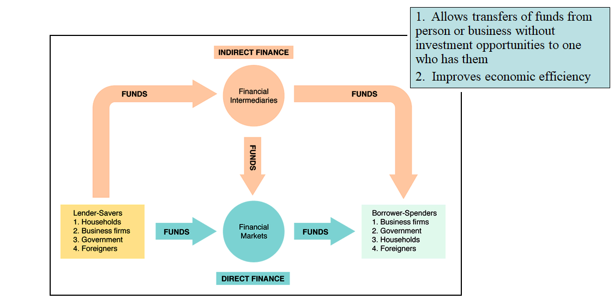
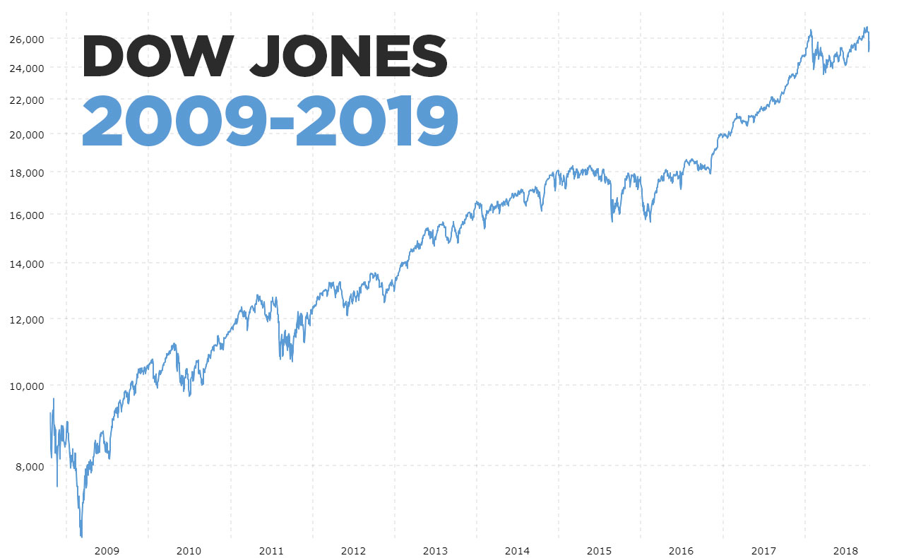
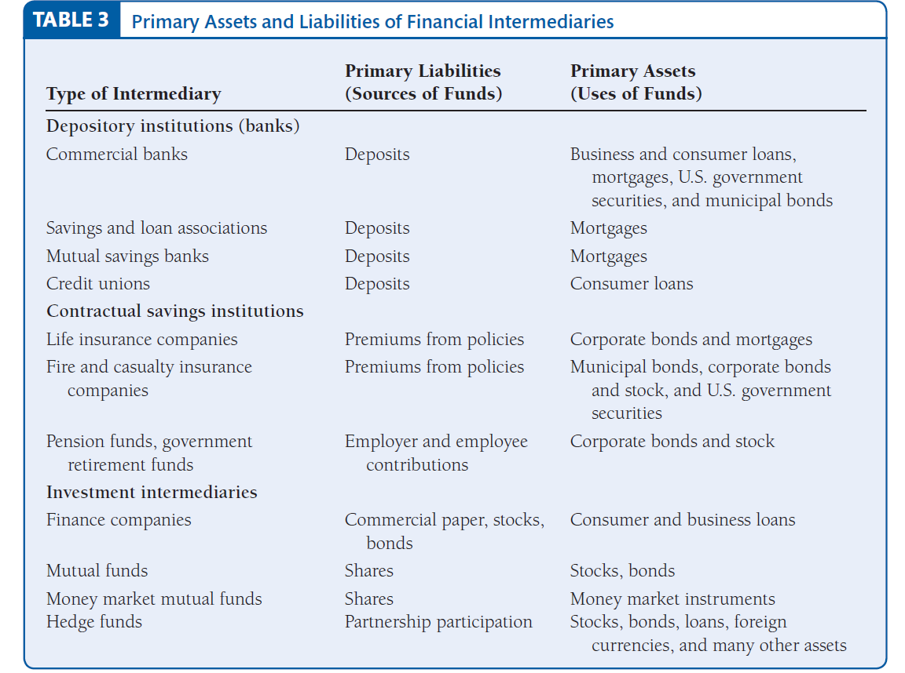

```{r, echo=FALSE, message=FALSE, warning=FALSE}
knitr::opts_knit$set(root.dir = 'F:/Teaching/Financial Economics/LectureNotes/')
```


# Why Study Finance?

### **Understand financial system --> economy system**


### **Fundamental concepts and theories of money, financial markets and financial institutions**
.font100[
- *Language created by professors are also used by practioners*

- *Relevant in financial decision making*

]


#### [**Finance became one of the most highly paid profession. **](https://www.bls.gov/cps/cpsaat11.htm)

.font80[
- [*Business and financial occupations*](https://www.bls.gov/ooh/business-and-financial/home.htm)

- [*Occupational projections for the financial industry*](https://www.bls.gov/opub/btn/volume-7/in-the-money-occupational-projections-for-the-financial-industry.htm)
]


---

## Financial Terms

.scroll-output[

**Real Assets**: Used to produce goods and services: Property, plants and equipment, human capital, etc.

**Financial Assets**: Claims on real assets or claims on real-asset income
	
**Security** (or *financial instrument*): claim on the issuer’s future income or assets	
	
**Bond**: debt security that promises to make periodic payments for a specified period of time

**Stock**: a share of ownership in a corporation, a claim (residual) on the earnings and assets of the corporation.

**Return**: How well a person does financially by holding a security over a particular time period is accurately measured by the security’s return, or, in more precise terminology, the rate of return.

**Interest Rate**: cost of borrowing or the price paid for the rental of funds

**Real interest rate**: the interest rate that is adjusted by subtracting expected changes in the price level (inflation) so that it more accurately reflects the true cost of borrowing.

**Interest-rate risk**: Changes in interest rates lead to capital gains and losses that produce substantial differences between the return and the yield to maturity known at the time the bond is purchased.

]


---

#### **Relevant in financial decision making**

.scroll-output[

.font80[

- Suppose you win a lottery of 100 million euros. Do you want to take 5 million a year over 20 years or just get 100 million right now?

- There are 30-year mortgages now you can get for 4.75% interest rate. There are 15-year mortgages you can get for less, for example 4.3% interest. Should you take the 15-year mortgage or the 30-year mortgage?

- You’re making a 50 000 euros a year and you are going to work for 35 years until you retire. Then you’re going to live another 20 years when you’re going to be making nothing. What you’d like to do is to consume inflation corrected the same amount every year after you retire and before you retire. Suppose inflation is 3%. How much of the 50 000 euros should you spend this year and how much should you save?

- A scientist discovers a potential cure for AIDS and he started a company. If it works he’s going to make a fortune. If it doesn’t work it’s going to be totally zero. Say the expected profit is equal to the profits of all of General Electric. Should his company be worth more than GE, the same as GE, or less than GE? 

- Suppose you believed in efficient markets and you rank all the stocks at the end of this year from top to bottom of which stock had the highest return over the year. Now, suppose you did the same thing in the following year with the same stocks, would you expect to get the same order, or the reverse order, or random order? 

- You’re a bank and you hold a bunch of mortgages. And you value all those mortgages at a 100 million euros. Suppose all the people had the same size mortgage. Now the government lowers the interest rates. Half of them take advantage to refinance. That shrunken pool, half as big as the original pool, is that worth 50 million or more than 50 million, or less than 50 million?

]

]


---

## Financial Innovation

#### Advance of information technology

#### Creation of new financial assets or new ways to use existing financial assets

#### Risks not easily conceptualized and each major risk category requires difficult institutional innovations to manage


## Finance and Psychology

#### A revolution in the finance profession, but not everyone has been captured by it

#### The Behavioral Finance Revolution

#### NBER-Sage Seminars on Behavioral Finance, with Richard Thaler, starting 1991 


---

## Finance and Management


#### Integration into all aspects of business management, including accounting, corporate strategy, industrial organization

#### Integration into government finance

#### Integration growing through time


## Finance and Law

#### Lawyers are often financial inventors

#### Law schools deal with all the minutiae

#### Often government role in process


---

# What Do you Expect to Learn?

--

### **An economic way of thinking...**

--

### Basic analytic framework for financial decision making


- Basic supply and demand approach to understand behaviors in financial markets

- Concept of equilibrium

- Transactions cost and asymmetric information approach to financial structure

- Elementary probability theory

- Real-time data analysis


---


# What Do you Expect to Learn?

.font100[

#### 1: **Financial system**

#### 2. **Financial intermediaries management**

#### 3. **Capital markets**

#### 4. **Regulation of the financial system**

#### 5: **Financial crisis**

#### 6: **Money markets**

#### 7: **Foreign exchange markets**

#### 8. **Behavioral finance**

]


---

# What Do you Expect to Learn?


- **What a stock, bond, or any risky asset is, and how to value it using canonical models, such as CAPM, APT, and Black-Scholes** 

- **The economists’ approach to decision making under uncertainty; link theoretical models with various economic and financial phenomena**

- **The role of money and financial intermediation in the economy**

- **Important episodes in financial history and regulation**

- **Trends in the financial marketplace and financial variables**

- **Frontier topics in financial economics**


---


# References

.font90[

**Frederic S. Mishkin (2018), The Economics of Money, Banking, and Financial Markets, 12th ed, PEARSON. ISBN 10: 0-13-473382-7.** 

**Zvi Bodie, Alex Kane & Alan Marcus (2013), Investments, 10th ed, McGraw-Hill Education. ISBN: 978-0077861674.**

Pires, Cesaltina (2011), Mercados e Investimentos Financeiros, 3ª ed, Escolar Editora. ISBN: 9789725923122.

Fabozzi, Frank, Modigliani, Franco & Jones, Frank (2014), Foundations of Financial Markets and Institutions, Pearson new international ed. - Harlow: Pearson.

Fernandes, Abel, Mota, Paulo, Alves, Carlos, & Rocha, Manuel (2018), Mercados, Produtos e Valorimetria de Activos Financeiros, Coimbra: Livraria Almedina, p. 484, 3º Edição.

Matthews, Kent & Thompson, Jonh (2008), The economics of banking. ISBN: 978-0-470-51964-6.

Robert, Shiller (2019), Narrative Economics: How Stories Go Viral and Drive Major Economic Events, Princeton University Press.
]


---

## Fundamental Works


#### **Harry Markowitz**: The diversification and modern portfolio theory (1950s)

.font70[.content-box-purple[
*"Finance has its birth in 1952 with the PhD thesis of Harry Markowitz on portfolio theory."*     - Eugene Fama
]]

#### **Merton Miller, Franco Modigliani**: The Modigliani–Miller theorem (1950s)


#### **William Sharpe**: The capital asset pricing model (CAPM) (1960s)

#### **Stephen Ross**: Arbitrage Pricing Theory (APT) (1970s)


#### **Egene Fama**: The efficient market theorem (1960s, 1970s)


#### **Fischer Black, Myron Scholes, Robert Merton**: The Black–Scholes-Merton model (1970s)

.font70[.content-box-purple[
*"The Black-Scholes paper is, in my view, the most important paper in economics of the 20th century. No other paper has to be learned by every single economist getting a PhD and has also created an industry—the derivatives industry."*     - Eugene Fama
]]


---

# Finance News and Blogs 

.pull-left[
[**Financial Times**](https://www.ft.com/)
Daily international business and economic news, founded in 1888 in London

[**Wall Street Journal**](https://www.wsj.com/)
U.S. based international daily newspaper, founded in 1889 in New York

[**The Economist**](https://www.economist.com/)
Weekly magazine-format newspaper since 1943, based in London

[**The New York Times**](https://www.nytimes.com/)
American newspaper based in New York City, founded in 1851

[**CNBC**](https://www.cnbc.com/world/?region=world)
American television business news real-time financial market coverage

]


.pull-right[
[**The Big Picture**](https://ritholtz.com/): 
*Barry Ritholtz*, investing, markets and the economy, behavioral analysis

[**Moneyness**](http://jpkoning.blogspot.com/)
*John Paul Koning*, economics, monetary policy, central banking, finance.

[**John Cochrane**](https://johnhcochrane.blogspot.com/)
Professor of finance and economics at Stanford

[**Dan Ariely**](http://danariely.com/)
Professor of Psychology and Behavioral Economics at Duke

[**Alex Edmans**](https://alexedmans.com/category/blog/)
Professor of Finance at LBS
]


---

# Finance Data

<br />

.font100[

[**U.S. Federal Reserve**](https://www.federalreserve.gov/data.htm)

[**U.S. Treasury**](https://www.treasury.gov/resource-center/data-chart-center/Pages/index.aspx)

[**European Central Bank Statistics**](https://www.ecb.europa.eu/stats/html/index.en.html)

[**Banco de Portugal**](https://www.bportugal.pt/genericohtml/economic-and-financial-data-portugal)

[**Yahoo Finance**](https://finance.yahoo.com/)

[**SEC Filings**](https://www.sec.gov/edgar/searchedgar/companysearch.html)

]


---

# Working Methods

.font100[

- Presential classes

- [Email](up649687@g.uporto.pt)
]

# Assessment 

- Midterm exam (April 11, 2023): 50%

- Final exam: 50%


---

class: center, middle, inverse

# **Financial System**

---

# Financial System

<br />


### **Function and Economic Relevance** 


### **Organization of Financial System** 


### **Financial Markets** 


### **Financial Intermediation** 


---

class: left

## Function of Financial System

<div align="center">

</div>

.font80[Source: Mishkin (2018), Figure 1, Chapter 2]

**The financial system is a network of institutions, markets and contracts that brings lenders and borrowers together**

---

## Organization  of Financial System


### Financial Markets

-	The process of direct financing using financial instruments to crowdsource funds and spread the risk around.

- A market where financial instruments like stocks or bonds are created or exchanged


### Financial Intermediation 

-	The process of indirect financing using financial intermediaries, helps getting funds from savers to investors

- Banks and Money Supply: crucial role in creation of money


---

class: center, middle, inverse

# **Financial Markets**

---

## Direct Finance

<div align="center">

</div>

.font80[Source: Mishkin (2018), Figure 1, Chapter 2]

---

<br />

<iframe width="800" height="450" src="https://www.youtube.com/embed/ZCFkWDdmXG8" frameborder="0" allow="accelerometer; autoplay; encrypted-media; gyroscope; picture-in-picture" allowfullscreen></iframe>

<div class="navy" align="center">
17 Apr 2020
</div>


---

## Organization  of Financial Markets

### By nature of financial claim: Debt Market vs. Equity Market

- Debt Markets: debt instruments 

- Equity Markets: common stocks (residual claim)


### By seasoning of claim: Primary Market vs. Secondary Market
	
- Primary Market: where securities are created (underwritten by investment banks)

- Secondary Market: where securities are traded (brokers and dealers)


---

## Organization  of Financial Markets


### By organizational structure: Exchange Market vs. OTC Market
	
- Exchanges: Trades conducted in central locations

- Over-the-Counter (OTC) Markets: Dealers at different locations buy and sell (e.g., government bonds, federal funds, foreign exchange instruments)


### By maturity of claim: Money Market vs. Capital Market

- Money Market: Short-term (maturity < 1 year), less risky
	
- Capital Market: Long-term (maturity > 1 year), more risky


---

## Financial Market Instruments

.scroll-output[

| Instrument|  Main Features| 
| :--- | :--- | 
| **Money Market Instruments**  |  | 
| *Treasury bills* | no interest payments, sell at a discount, very liquid, indicator of general interest-rate movements  |
| *Negotiable bank certificates of deposit* | important source of funds for commercial banks |
| *Commercial paper* | short-term debt instrument issued by large banks and well-known corporations |
| *Security Repurchase Agreements (repos)* | short-term loans for which Treasury bills serve as collateral |
| *Federal funds* | typically overnight loans between banks of their deposits at the Federal Reserve |
| **Capital Market Instruments**  |  | 
| *Corporate stocks* | equity claims on the net income and assets of a corporation  |
| *Corporate bonds* | issued by corporations with very strong credit ratings, typically pay interest twice a year |
| *Bank commercial loans* |  loans to business |
| *Residential mortgages* | mortgages are loans to purchase land or real structures in which the structure or land itself serves as collateral for the loans |
| *Consumer loans* | loans to consumers  |
| *Government securities* | long-term debt instruments issued by the U.S. Treasury to finance the deficits of the federal government  |
| *Government agency securities* | long-term bonds issued by various government agencies, tipically guaranteed by the federal government   |
| *State and local government bonds* | long-term bonds issued by state and local governments to finance large expenditures   |
| **International Bond Markets**  |  | 
| *Foreign bonds* | sold in a foreign country and are denominated in that country’s currency  |
| *Eurobonds* | a bond denominated in a currency other than that of the country in which it is sold  |
| *Eurocurrencies* | foreign currencies deposited in banks outside the home country, e.g., *Eurodollars*   |

]

---

class: center, middle, inverse

# **Equity Market Vs. Debt Market**

---

## Equity Markets
	
<div align="center">

</div>

.font80[
*Source*: John Paul Koning

[DOW JONES – LAST 10 YEARS](https://www.macrotrends.net/1358/dow-jones-industrial-average-last-10-years)
]


---

## S&P 500

```{r, echo=FALSE, warning=FALSE, message=FALSE, cache=FALSE, warning=FALSE, comment=FALSE}
library(ggplot2)
library(plotly)
library(stats)
library(graphics)
library(haven)
setwd("F:/Teaching/Financial Economics/LectureNotes/")
sp <- read_dta("Data/Equity/GSPC_SP500_2021.dta")
sp2 <- sp[which(sp$year >=2009 & sp$year <=2019), ]
p <- ggplot(sp2, aes(x=date, y=adjclose)) + geom_line(color = "#09557f") +
  labs(x = "Date", 
       y = "Adjusted Closing Price") +scale_x_date(date_breaks = "2 year", date_labels =  "%Y")+ theme(axis.text.x = element_text(angle = 45, vjust = 1, hjust=1))
#+ scale_x_date(date_breaks = "1 year", date_labels =  "%Y") 
#p
ggplotly(p)
```


---

## S&P 500 

```{r, echo=FALSE, warning=FALSE, message=FALSE, cache=FALSE, warning=FALSE, comment=FALSE}
library(ggplot2)
library(plotly)
library(stats)
library(graphics)
library(haven)
library(Hmisc)
setwd("F:/Teaching/Financial Economics/LectureNotes/")
sp <- read_dta("Data/Equity/GSPC_SP500_2021.dta")
sp$close_real <- 100*(sp$adjclose)/sp$cpiaucsl
sp2 <- sp[which(sp$year >=1950 & sp$year <=2021), ]
p <- ggplot() + 
  geom_line(data = sp2, aes(x = date, y = adjclose), color = "#09557f" ) +
  geom_line(data = sp2, aes(x = date, y = close_real), color = "red") +     
geom_text(aes(x = as.Date("2018-01-01"), y = 3300, label = "nominal")) + 
geom_text(aes(x = as.Date("2019-01-01"), y = 1300, label = "real"))+
  labs(x = "Date", 
       y = "Adjusted Closing Price")+scale_x_date(date_breaks = "2 year", date_labels =  "%Y")+ theme(axis.text.x = element_text(angle = 45, vjust = 1, hjust=1))
# + scale_x_date(date_breaks = "years" , date_labels = "%y")

p <- p + annotate("text", x = as.Date("2017-01-01"), y = 3000, label = "Annualized \n12.1% \nfrom 1980", colour = "blue", fontface =3) + annotate("text", x = as.Date("2017-01-01"), y = 1400, label = "Annualized \n7.7% \nfrom 1980", colour = "blue", fontface =3)

ggplotly(p)
```

---

## Arithmetic Return or Geometric Return? 

If your portfolio goes up by 50% and then declines by 50%, are you back where you started?

--


$$r=\frac{(p_n-p_0)}{p_0}$$

$$1+r=\frac{p_n}{p_0}$$


$$log(1+r)=log(\frac{p_n}{p_0})=log(p_n)-log(p_0)\approx r$$


---

## Arithmetic Return or Geometric Return?


The CAGR (compound annual growth rate, annualized return) is a measurement of the actual return achieved over the number of years examined.


$$CAGR=(\frac{p_n}{p_0})^{(\frac{1}{n})}-1$$


$$(1+r_1) \times (1+r_2)...\times (1+r_n)=\prod_{i=1}^{N}(1+r_i)$$

The compound return over n periods is merely the difference in log between initial and final periods

$$\sum_{i=1}^{N} log(1+r_i)=log(1+r_1) + log(1+r_2) + ...... + log(1+r_n)=log(p_n) - log(p_0)$$ 


---

## S&P 500

```{r, echo=FALSE, warning=FALSE, message=FALSE, cache=FALSE, warning=FALSE, comment=FALSE}
library(ggplot2)
library(plotly)
library(stats)
library(graphics)
library(haven)
library(Hmisc)
sp <- read_dta("Data/Equity/GSPC_SP500_2021.dta")
sp$close_real <- 100*(sp$adjclose)/sp$cpiaucsl
sp$adjclose2 <- log(sp$adjclose)
sp$close_real2 <- log(sp$close_real)
sp2 <- sp[which(sp$year >=1950 & sp$year <=2021), ]
p <- ggplot() + 
  geom_line(data = sp2, aes(x = date, y = adjclose2), color = "#09557f" ) +
  geom_line(data = sp2, aes(x = date, y = close_real2), color = "red") +  
  geom_text(aes(x = as.Date("2020-01-01"), y = 8.5, label = "nominal")) + 
geom_text(aes(x = as.Date("2020-01-01"), y = 7.5, label = "real"))+
  labs(x = "Date", 
       y = "log(Adjusted Closing Price)")+scale_x_date(date_breaks = "2 year", date_labels =  "%Y")+ theme(axis.text.x = element_text(angle = 45, vjust = 1, hjust=1))
# + scale_x_date(date_breaks = "years" , date_labels = "%y")

p <- p + annotate("text", x = as.Date("1985-01-01"), y = 7.5, label = "A vertical move of 0.01 corresponds to \na 1% change at any point", colour = "black", fontface =3)

ggplotly(p)
```

---

## S&P 500

```{r, echo=FALSE, warning=FALSE, message=FALSE, cache=FALSE, warning=FALSE, comment=FALSE}
library(ggplot2)
library(plotly)
library(stats)
library(graphics)
library(haven)
library(Hmisc)
sp <- read_dta("Data/Equity/GSPC_SP500_2021.dta")
sp$l1close <- Lag(sp$adjclose, -1)
sp$volat <- 100*(sp$adjclose-sp$l1close)/sp$l1close
sp2 <- sp[which(sp$year >=1980 & sp$year <=2020), ]
p <- ggplot(sp2, aes(x=date, y=volat)) + geom_line(color = "#09557f") +
  labs(x = "Date", 
       y = "Volatility") +scale_x_date(date_breaks = "2 year", date_labels =  "%Y")+ theme(axis.text.x = element_text(angle = 45, vjust = 1, hjust=1))
# + scale_x_date(date_breaks = "years" , date_labels = "%y")
ggplotly(p)
```

---

## Apple

```{r, echo=FALSE, warning=FALSE, message=FALSE, cache=FALSE, warning=FALSE, comment=FALSE}
library(ggplot2)
library(plotly)
library(stats)
library(graphics)
library(haven)
library(Hmisc)
setwd("F:/Teaching/Financial Economics/LectureNotes/")
sp <- read_dta("Data/Equity/AAPL_2021.dta")
sp$close_real <- 100*(sp$adjclose)/sp$cpiaucsl
sp2 <- sp[which(sp$year >=1980 & sp$year <=2021), ]
p <- ggplot() + 
  geom_line(data = sp2, aes(x = date, y = adjclose), color = "#09557f") +
  geom_line(data = sp2, aes(x = date, y = close_real), color = "red") +     
geom_text(aes(x = as.Date("2018-01-01"), y = 100, label = "nominal")) + 
geom_text(aes(x = as.Date("2021-01-01"), y = 50, label = "real"))+
  labs(x = "Date", 
       y = "Adjusted Closing Price")+scale_x_date(date_breaks = "2 year", date_labels =  "%Y")+ theme(axis.text.x = element_text(angle = 45, vjust = 1, hjust=1))
# + scale_x_date(date_breaks = "years" , date_labels = "%y")

p <- p + annotate("text", x = as.Date("2017-01-01"), y = 130, label = "Annualized \n24.5%", colour = "blue", fontface =2) + annotate("text", x = as.Date("2019-01-01"), y = 30, label = "Annualized \n20.1%", colour = "blue", fontface =2)

p
#ggplotly(p)
```

---

## Apple

```{r, echo=FALSE, warning=FALSE, message=FALSE, cache=FALSE, warning=FALSE, comment=FALSE}
library(ggplot2)
library(plotly)
library(stats)
library(graphics)
library(haven)
library(Hmisc)
setwd("F:/Teaching/Financial Economics/LectureNotes/")
sp <- read_dta("Data/Equity/AAPL_2021.dta")
sp$close_real <- 100*(sp$adjclose)/sp$cpiaucsl
sp$lnclose <- log(sp$adjclose)
sp$lnclose_real <- log(sp$close_real)
sp2 <- sp[which(sp$year >=1980 & sp$year <=2021), ]
p <- ggplot() + 
  geom_line(data = sp2, aes(x = date, y = lnclose), color = "#09557f") +
  geom_line(data = sp2, aes(x = date, y = lnclose_real), color = "red") +
  geom_text(aes(x = as.Date("2018-01-01"), y = 5, label = "nominal")) + 
geom_text(aes(x = as.Date("2021-01-01"), y = 2.5, label = "real"))+
  labs(x = "Date", 
       y = "Log(Adjusted Closing Price)") + scale_x_date(date_breaks = "2 year", date_labels =  "%Y")+ theme(axis.text.x = element_text(angle = 45, vjust = 1, hjust=1))
# + scale_x_date(date_breaks = "years" , date_labels = "%y")

p
#ggplotly(p)
```


---

## Apple 

```{r, echo=FALSE, warning=FALSE, message=FALSE, cache=FALSE, warning=FALSE, comment=FALSE}
library(ggplot2)
library(plotly)
library(stats)
library(graphics)
library(haven)
library(Hmisc)
setwd("F:/Teaching/Financial Economics/LectureNotes/")
sp <- read_dta("Data/Equity/AAPL_2021.dta")
sp$l1close <- Lag(sp$adjclose, -1)
sp$volat <- 100*(sp$adjclose-sp$l1close)/sp$l1close
sp2 <- sp[which(sp$year >=1980 & sp$year <=2020), ]
p <- ggplot(sp2, aes(x=date, y=volat)) + geom_line(color = "#09557f") +
  labs(x = "Date", 
       y = "Volatility") +scale_x_date(date_breaks = "2 year", date_labels =  "%Y")+ theme(axis.text.x = element_text(angle = 45, vjust = 1, hjust=1))
# + scale_x_date(date_breaks = "years" , date_labels = "%y")
p
#ggplotly(p)
```

---

## Debt Markets

- The market where debt instruments (assets that require a fixed payment to the holder, usually with interest) are traded. 

```{r, echo=FALSE, warning=FALSE, message=FALSE, cache=FALSE, warning=FALSE, comment=FALSE}
library(ggplot2)
library(plotly)
library(stats)
library(graphics)
library(haven)

setwd("F:/Teaching/Financial Economics/LectureNotes/")
# The palette with black:
cbbPalette <- c("black", "#E69F00", "darkred", "#009E73", "#999999")
sp <- read_dta("Data/Treasury/Treasury2.dta")
sp2 <- sp[which(sp$year >=1950 & sp$year <=2020), ]
p <- ggplot(sp2, aes(x=date, y=yield, group=Instrument, colour=Instrument)) + 
  geom_line(size=0.6)+ labs(x = "Date", y = "Yield")+scale_fill_manual(values=cbbPalette)+scale_colour_manual(values=cbbPalette)+ theme(legend.position = c(0.8, 0.7), axis.text.x = element_text(angle = 45, vjust = 1, hjust=1))+scale_x_date(date_breaks = "5 year", date_labels =  "%Y")
p
#ggplotly(p)
```

Source: [**Federal Reserve Economic Data | FRED | St. Lou**](https://fred.stlouisfed.org/)is Fed

[**What’s the Fed doing in response to the COVID-19 crisis?**](https://www.brookings.edu/research/fed-response-to-covid19/#:~:text=Near%2DZero%20Interest%20Rates,of%200%25%20to%200.25%25.)


---

## Bond Pricing

The price or value of a financial asset is equal to the present value of all expected future cash flows.

$$P=\sum_{i=1}^{N} \frac{C}{(1+r)^i}+ \frac{M}{(1+r)^N}$$

*where* *P* = market price of bond, *C* = coupon payment, *N* = number of payments, *r* = market interest rate, or required yield, or observed/appropriate yield to maturity, *M* = value at maturity, usually equals face value. 

--

- Current bond prices and interest rates are negatively related

- Prices and returns for long-term bonds are more volatile than those for shorter-term bonds

- When the real interest rate is low, there are greater incentives to borrow and fewer incentives to lend.


---

class: center, middle, inverse

# **Financial Intermediation**

---

## Indirect Finance

<div align="center">

</div>

.font80[Source: Mishkin (2018), Figure 1, Chapter 2]

---

## Why Are FIs So Important? 


### Transactions Costs
.font80[

- Financial intermediaries make profits by reducing transactions costs 

    - Developing expertise
    
    - **Economies of scale**

- Provide liquidity services that enable depositors to earn interest and yet still convert them into goods and services whenever necessary


]

--


### Risk Sharing
.font80[


- **Diversification**: lower risk by helping people to diversify portfolios, i.e., investing in a portfolio of assets ratehr than in individual assets

- **Asset Transformation**: Create and sell assets with low risk characteristics and then use the funds to buy assets with more risk i.e., risky assets are transformed into safe assets for investors

]

---

## Why Are FIs So Important? 


### Asymmetric Information


#### **Adverse Selection**
.font80[
- Before transaction occurs

- Potential borrowers most likely to produce adverse outcomes are ones most likely to seek loans and be selected
]

#### **Moral Hazard**
.font80[
- After transaction occurs

- Hazard that borrower has incentives to engage in undesirable (immoral) activities making it more likely that won’t pay loan back

- Ubiquity of moral hazard problems

- Practical finance has developed institutions to promote risk management while dealing with moral hazard

]

---

## Why Are FIs So Important? 

### Economies of Scope

- Banks providing multiple financial services to clients, lowering cost of information production


### ! Conflict of Interests

- A type of moral hazard problem, arise when a person or institution has multiple objectives (interests), some of which conflict with each other

- Potentially competing interests of bank services may lead an individual or a firm or a bank to conceal information or disseminate misleading information


---

## Types of Financial Intermediaries 

<div align="center">

</div>

.font80[
Source: Mishkin (2018), Figure 1, Chapter 2
]

---

## Regulation of Financial System

- Regulations are legal restrictions circulated by government authority

- Financial system is among the most heavily regulated sectors of the economy

- Banks are among the most heavily regulated of financial institutions

- The time and energy spent on regulatory compliance activities are costly

- However, regulations sometimes can’t prevent financial crisis


---

## Main Reasons for Regulation

###  Increasing Information Available to Investors

- Information Disclosure

- Restriction of Insider Trading

###	 Ensuring the soundness of financial intermediaries

- Prevent financial panics and market failure

    - Discosure
    - Deposit Insurance    
    - Restrictions on entry, foreign participation, financial activities, assets held, competition and fairness, interest rates


---

class: center, middle, inverse

# **Additional Materials**

---

# What Are the Big Pictures?

.pull-left[

<iframe width="800" height="450" src="https://www.youtube.com/embed/y0GHcKVesn4" frameborder="0" allow="accelerometer; autoplay; encrypted-media; gyroscope; picture-in-picture" allowfullscreen></iframe>

<div class="navy">
8 Feb 2023

</div>


]

.pull-right[

<iframe width="800" height="450" src="https://www.youtube.com/embed/cWE8a_Ge4aU" frameborder="0" allow="accelerometer; autoplay; encrypted-media; gyroscope; picture-in-picture" allowfullscreen></iframe>

<div class="navy" align="center">
22 Dec 2022
</div>


]

---

# What Were the Big Pictures?

.pull-left[

<iframe width="800" height="450" src="https://www.youtube.com/embed/0TImic4N1ko" frameborder="0" allow="accelerometer; autoplay; encrypted-media; gyroscope; picture-in-picture" allowfullscreen></iframe>

<div class="navy">
24 Jul 2020
</div>

]

.pull-right[

<iframe width="800" height="450" src="https://www.youtube.com/embed/dnp-tohIC8E" frameborder="0" allow="accelerometer; autoplay; encrypted-media; gyroscope; picture-in-picture" allowfullscreen></iframe>

<div class="navy" align="center">
6 Aug 2020
</div>

]


---

# What Were the Big Pictures?


.pull-left[


<iframe width="800" height="450" src="https://www.youtube.com/embed/lyzS7Vp5vaY" frameborder="0" allow="accelerometer; autoplay; encrypted-media; gyroscope; picture-in-picture" allowfullscreen></iframe>

<div class="navy" align="center">
6 May, 2019
</div>

]

.pull-right[

<iframe width="800" height="450" src="https://www.youtube.com/embed/rUYk2DA8PH8" frameborder="0" allow="accelerometer; autoplay; encrypted-media; gyroscope; picture-in-picture" allowfullscreen></iframe>

<div class="navy" align="center">
1 Apr, 2019
</div>

]


---

# What Were the Big Pictures?

.pull-left[

<iframe width="800" height="450" src="https://www.youtube.com/embed/HJuizgDmvzU" frameborder="0" allow="accelerometer; autoplay; encrypted-media; gyroscope; picture-in-picture" allowfullscreen></iframe>

<div class="navy" align="center">
14 Jan, 2019
</div>


]

.pull-right[

<iframe width="800" height="450" src="https://www.youtube.com/embed/-8H-6VHUt9s" frameborder="0" allow="accelerometer; autoplay; encrypted-media; gyroscope; picture-in-picture" allowfullscreen></iframe>

<div class="navy">
13 Sep, 2018
</div>

]


