```{r, echo=FALSE, message=FALSE, warning=FALSE}
setwd("C:/Financial Economics/LectureNotes/")
```


## Recap.

- Function and economic relevance of financial system

- Organization of financial system 

- Principles of financial intermediation 

- Types of financial intermediaries 

- Financial intermediation

  - Transactions costs
  
  - Economies of scope
  
  - Risk sharing
  
  - Asymmetric information (adverse selection, moral hazard)
  
  - Conflict of interests (agency issues)
  
---

## Recap. 

- Organization of Financial Markets

<div align="center">
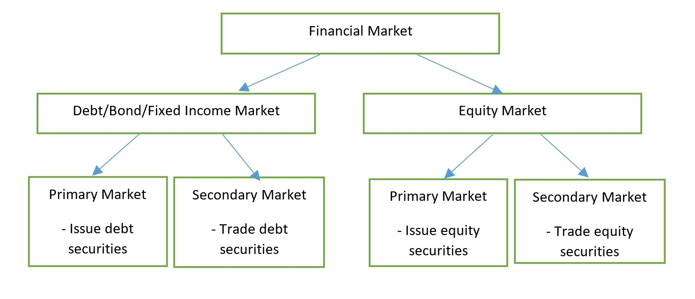
</div>

---

## Recap. 

- Over-the-Counter Market

    - A decentralized market in which market participants trade financial instruments directly between two parties and without a central exchange or broker. 
    
    - Does not have physical locations; instead, trading is conducted electronically. 
    
    - Typically less transparent than exchanges and are also subject to fewer regulations
    
    - Limited liquidity; liquidity totally dried up in the absence of buyers during the crisis 
    
    - Mortgage-backed securities and other derivatives such as CDOs and CMOs were traded solely in the OTC markets
    
    - Use of clearinghouses for post-trade processing of OTC trades in the aftermath of the crisis


---

class: center, middle, inverse

# **Financial Crises**

---

## Financial Crises

<br />

.font120[
<blockquote>
Mishkin (2018): Financial crises are major disruptions in financial markets characterized by sharp declines in asset prices and firm failures. A financial crisis occurs when information flows in financial markets experience a particularly large disruption, with the result that financial frictions increase sharply and financial markets stop functioning.
</blockquote>
]

---

## Financial Crises
<br />

### How Often Do They Happen?

### Why do they happen?

### How do they get out of control?

### Why do we care?

### What do we learn?

---

## How Often Do They Happen?

[**Economic Crises**](https://en.wikipedia.org/wiki/List_of_economic_crises#2000s) 

- Stock market crash 1929

- Great Depression 1930s

- Stock market crash 1987

- Mexican Crisis 1994

- Asian financial crisis of 1997-1998

- Nasdaq crash of 2000-2001

- Financial crisis of 2007-2009

- European sovereign debt crisis 2010s

- 2010-2014 Portuguese financial crisis

- COVID-19 recession?

---

## How Often Do They Happen?

<br />

<div align="center">
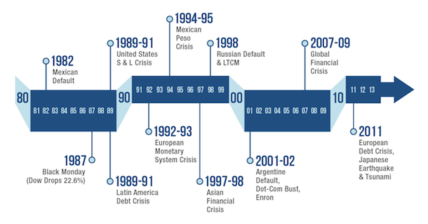
</div>

.font80[
*Source*: Miguel Otero-Iglesias, [Financial crises and flushing toilets](https://blog.realinstitutoelcano.org/en/financial-crises-flushing-toilets/)
]


[**Stock Market Events**](https://finance.yahoo.com/calendar) 


---

## What Happened in the Financial Crisis?

--

<div align="center">

</div>


---

## What Happened in the Financial Crisis?

<br />

.font100[
- Bad Shock (Sunspots - economic uncertainty that does not come from variation in economic fundamentals, bad fundamental news, spike in spreads)

- Amplification Mechanism (short term debt, illiquidity, agency problems, adverse selection)

- Recession (impaired intermediation)
]

---

## What Happened in the Financial Crisis?


<div align="center">
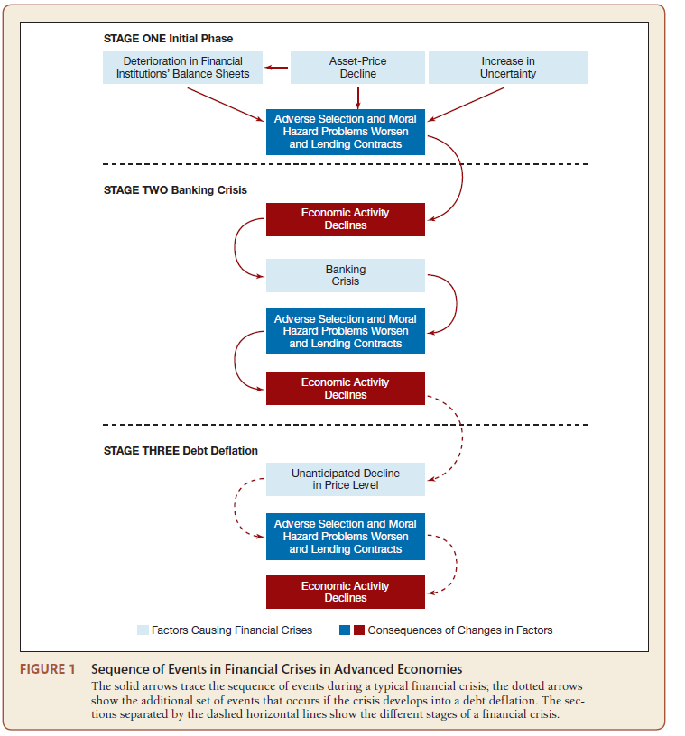
</div>

.font80[
Source: Mishkin (2018), Figure 1, Chapter 12
]

---

## What Happened in the Financial Crisis?

### [The Great Depression](http://www.amatecon.com/greatdepression.html)

--
.font130[
[Stock Market Crash in October 1929](https://www.federalreservehistory.org/essays/stock-market-crash-of-1929) 
]
--


$\\$ Bank Panics 

--

$\\$ Continuing Decline in Stock Prices 

--

$\\$ Debt Deflation 

--

$\\$ International Dimensions


--

$\\$ World War II


---

## What Happened in the Financial Crisis?

### [The Great Recession](https://www.federalreservehistory.org/essays/great-recession-and-its-aftermath)

.font130[
[Boom in residential housing prices](https://fred.stlouisfed.org/series/TDSP)
]
--

.font90[
$\\$ Bust in residential housing prices 


$\\$ Values of mortgage-backed securities fall


$\\$ Deterioration of financial institutions’ balance sheets 
]
--
.font90[
$\\$ Haircuts in repo agreements 

$\\$ Tighter funding of FIs, fire sales of assets 

$\\$ Further decline in financial institutions’ asset values 
]
--
.font90[
$\\$ Run on the shadow banking system 

$\\$ Liquidity dry-up 
]
--
.font90[
$\\$ .bond[Spillover to global financial markets]

]
---

## What Caused The Financial Crisis of 2007-2009

--

### Financial Innovation in the Mortgage Markets

.font90[
<blockquote>
.bold[Securitization] is the process of bundling .bold[small and otherwise illiquid] financial assets (such as residential mortgages, auto loans, and credit card receivables) into .bold[marketable] capital market securities.
</blockquote>
]

<br />

.font90[
<blockquote>
Securitization is a process of asset transformation that involves a number of different financial institutions, comprising the shadow banking system.
</blockquote>
]


---

## What Caused The Financial Crisis of 2007-2009

.pull-left[

.font80[

**The 1999 Financial Services Modernization Act**: 

The Gramm–Leach–Bliley Act

**Mortgage Backed Securities: MBS**

A **MBS** is a type of asset-backed security which is secured by a mortgage or collection of mortgages.]

<iframe width="400" height="225" src="https://www.youtube.com/embed/JDjjsCunnhI" frameborder="0" allow="accelerometer; autoplay; encrypted-media; gyroscope; picture-in-picture" allowfullscreen></iframe>

<div class="navy" align="center">
.font80[Source: The Big Short]
</div>

]


.pull-right[

.font80[

**Explosion of Subprime Mortgage (2000s)**

**Subprime Mortgage** is a new class of residential mortgages offered to borrowers with less-than-stellar credit records.

Lax regulation of subprime mortgages with adjustable rates, two year teaser rates

**Predatory Lending Practices**]

<iframe width="400" height="225" src="https://www.youtube.com/embed/qFHIFDJRHSM?list=PLLOBC2RVibztxU0HQo6DPYbjoKr28ppqF" frameborder="0" allow="accelerometer; autoplay; encrypted-media; gyroscope; picture-in-picture" allowfullscreen></iframe>

<div class="navy" align="center">
.font80[Source: The Big Short]
</div>

]

---

## What Caused The Financial Crisis of 2007-2009


**Collateralized debt obligation: CDOs**

.font80[A **CDO** is a type of structured asset-backed security. Originally developed as instruments for the corporate debt markets, after 2002 CDOs became vehicles for refinancing mortgage-backed securities. **CDOs can be structured into CDO2s, CDO3s...**]

.center[
<iframe width="500" height="300" src="https://www.youtube.com/embed/AUM59Eh6vTw" frameborder="0" allow="accelerometer; autoplay; encrypted-media; gyroscope; picture-in-picture" allowfullscreen></iframe>
]


<div class="navy" align="center">
.font80[Source: The Big Short]
</div>


---

## What Caused The Financial Crisis of 2007-2009

- **Credit default swaps: SWAPS**

.font80[Unregulated OTC derivatives sold as insurance against mortgage backed securities, e.g., AIG]


.pull-left[

<iframe width="400" height="225" src="https://www.youtube.com/embed/Cxjdj5_5yNM" frameborder="0" allow="accelerometer; autoplay; encrypted-media; gyroscope; picture-in-picture" allowfullscreen></iframe>

]

.pull-right[

<iframe width="400" height="225" src="https://www.youtube.com/embed/xbiDrzTd8fE" frameborder="0" allow="accelerometer; autoplay; encrypted-media; gyroscope; picture-in-picture" allowfullscreen></iframe>

]

<div class="navy" align="center">
.font80[Source: The Big Short]
</div>


---

## What Caused The Financial Crisis of 2007-2009

--

### Agency problems in the Mortgage Markets


**1. A originate-to-distribute business model**

.content-box-purple[.font80[Loan Origination --> Servicing --> Bundling --> Distribution]]

**2. Credit-rating agencies**

**3. GSEs (Fannie Mae and Freddie Mac)** 

.font80[
Government-sponsored monopoly in a large part of the U.S. secondary mortgage market; government's implicit guarantee
]

.pull-left[

<iframe width="400" height="225" src="https://www.youtube.com/embed/mwdo17GT6sg" frameborder="0" allow="accelerometer; autoplay; encrypted-media; gyroscope; picture-in-picture" allowfullscreen></iframe>

]

.pull-right[

<iframe width="400" height="225" src="https://www.youtube.com/embed/SQTbbUASPLQ" frameborder="0" allow="accelerometer; autoplay; encrypted-media; gyroscope; picture-in-picture" allowfullscreen></iframe>

]

<div class="navy" align="center">
.font80[Source: The Big Short]
</div>


---

## Financial System Losses Estimates

.font70[**October 2007**:
-  ~$200 billion mark-to-market losses on all asset-backed securities (mostly MBS) and CDOs

**March 2008**:
-  $720 billion global losses on all securities (including corporate debt)
-  ~$200 billion U.S. bank losses

**October 2008**:
- $980 billion global losses on all securities
- ~$400 billion U.S. bank losses

**April 2009**:
- $1.64 trillion global losses on all securities
- $1.07 trillion global losses on all loans
- ~$800 billion U.S. bank losses

**October 2009**:
- $1 trillion U.S. bank losses
]

.font80[Source: International Monetary Fund, Global Financial Stability Reports.]


---

## Government Intervention

<blockquote>
.font80[**Lender of Last Resort (LLR)**: A lender of last resort is an individual, a private institution, or, more commonly, a government central bank that attempts to stop a financial panic and/or postpanic de-leveraging by increasing the money supply, decreasing interest rates, making loans, and/or restoring investor confidence.]
</blockquote>

<br />

<blockquote>
.font80[**Bailouts**: Bailouts usually occur after the actions of a lender of last resort, such as a central bank, have proven inadequate to stop negative effects on the real economy. Bailouts restore the losses suffered by one or more economic agents, usually with taxpayer money.]
</blockquote>

<br />

<blockquote>
.font80[**Resolutions**: In resolutions, assets are sold off to compensate creditors and owners according to their seniority (depositor, bondholder, stockholder).]
</blockquote>


---

## Government Intervention in Emergency

### The Wall Street Bailout

.font100[
- March 2008: Bear Stearns sold to J.P. Morgan for less than one-tenth of its worth with Federal Reserve takeing over $30 billion of Bear Stearns’s hard-to-value assets

- July-September, 2008: Bailout of Fannie Mae and Freddie Mac 

- September 14, 2008: Merrill Lynch announced its sale to Bank of America for a price 60% below its value

- September 15, 2008: Lehman Brothers filed for bankruptcy

- September 16, 2008: Federal Reserve provided an $85 billion two-year loan to AIG and had to write over $400 billion of CDS contracts to prevent its bankruptcy and further stress on the global economy

]


---

## Government Intervention in Emergency

### Emergency Economic Stabilization Act (October 3, 2008)

.font100[
- Troubled Asset Relief Program (TARP):  $700 billion (ended up with $250 billion) bailout package

- Federal deposit insurance limit temporarily raised from $100,000 to $250,000

- Guarantees for newly issued debt by Federal Deposit Insurance Corporation (FDIC) 

- US Treasury guaranteed for a year money market mutual fund shares at par value
 ]
 
### Fiscal Stimulus

.font100[
- $800 billion through new spending and tax cuts
]


---

## Too Big to Fail

.center[

<iframe width="800" height="450" src="https://www.youtube.com/embed/QcoHpiiWc9Q" frameborder="0" allow="accelerometer; autoplay; encrypted-media; gyroscope; picture-in-picture" allowfullscreen></iframe>

]

<div class="navy" align="center">
.font80[Source: Too Big to Fail]
</div>

---

## Changes in Financial Regulation

### From Microprudential to Macroprudential Supervision: Dodd-Frank Wall Street Reform of 2010

.font100[

- Consumer Protection Act (Consumer Financial Protection Bureau)

- Systemic Risk Regulation: additional regulation for Systemically Important Financial Institutions (SIFIs)

- Annual Stress Tests: banks with assets of more than $10 billion

- Resolution Authority (Orderly Liquidation Authority)

- Limits on Federal Reserve Lending

- Volcker Rule: limited in the extent of bank's proprietary trading

- Derivatives: transparent trading, customized derivative products are subject to higher capital requirements, banks are banned from some of the derivative-dealing operations

]

---

## Wall Street Reform?

.center[

<iframe width="800" height="450" src="https://www.youtube.com/embed/sSk2SvdopGY" frameborder="0" allow="accelerometer; autoplay; encrypted-media; gyroscope; picture-in-picture" allowfullscreen></iframe>

]

<div class="navy" align="center">
.font80[Source: Inside Job]
</div>


---

## [Dating the Financial Crisis](https://fcic.law.stanford.edu/)

### [Financial Crisis of 2007-2009](https://fraser.stlouisfed.org/timeline/financial-crisis/)

--

[**Fixed Income Market Yield Spreads**](https://fredblog.stlouisfed.org/2014/05/dating-the-financial-crisis-using-fixed-income-markets-yields-spreads/?utm_source=series_page&utm_medium=related_content&utm_term=related_resources&utm_campaign=fredblog)

<div align="center">
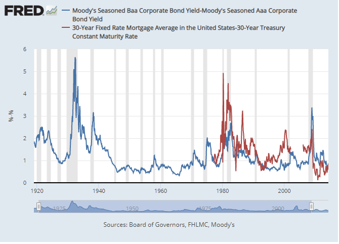
</div>

.font80[Source: Federal Reserve Bank of St. Louis Blog (2014).]

---

## Dating the Financial Crisis

[**Case-Shiller Indices**](https://fred.stlouisfed.org/searchresults/?st=Case-Shiller)

.font80[Robert Shiller’s inflation-adjusted index of sale prices of standard existing homes in
the United States, set to 100 in 1890.]

<div align="center">
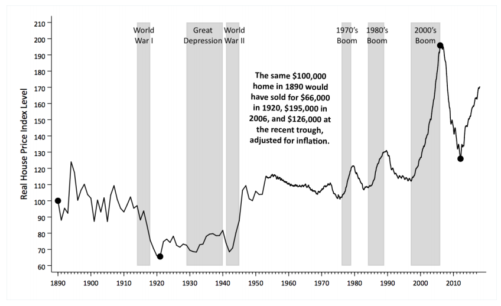
</div>

.font80[Source: Shiller (2016).]


---

## Dating the Financial Crisis

**U.S. Subprime Mortgage Originations**: .font80[Total U.S. subprime mortgage originations are broken down into those securitized and those non-securitized. U.S. subprime mortgage originations are also given as a percentage of total U.S. mortgage originations.]

<div align="center">
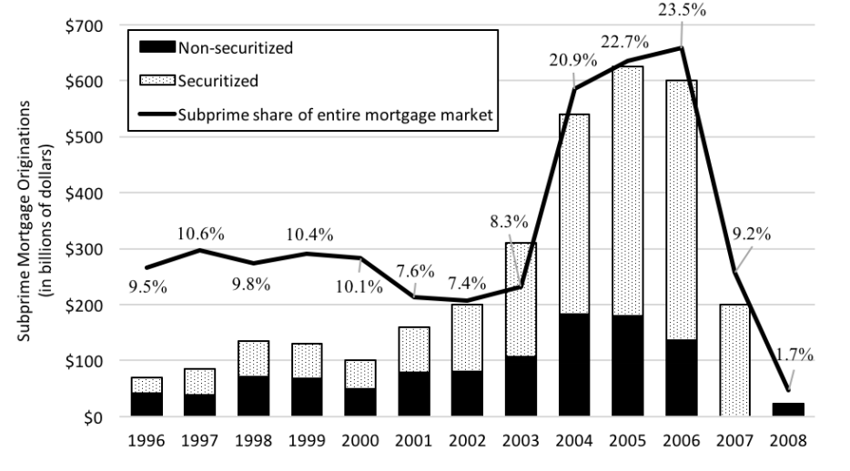
</div>

.font80[Source: Financial Crisis Inquiry Commission (2011).]


---

## Dating the Financial Crisis

**Evolution of Leverage Ratios at Major Investment Banks**

<div align="center">
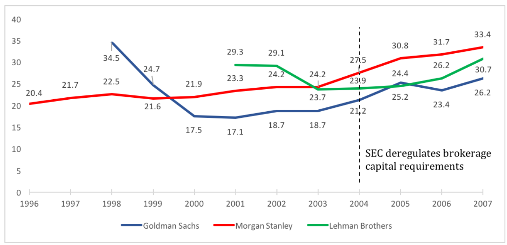
</div>

.font80[Note: Leverage ratio = Total Assets/Shareholders’ Equity]

.font80[Source: Company 10K reports.]

---

## Dating the Financial Crisis

**Cumulative Default Probability by Origination Cohort**: .font80[The default behavior of mortgages originated in five different years (cohorts).]

<div align="center">

</div>

.font80[Note: A loan is considered to default when it is indicated to be in foreclosure of real estate owned and as long as it is not later repaid in full.]

.font80[Source: Palmer (2015).]

---

## Dating the Financial Crisis

**Prices of Residential Mortgage-Backed Securities**: .font80[The Markit ABX Home Equity Index (ABX.HE), which tracks the performance of residential mortgage-backed securities (RMBS) of different issuer ratings.]

<div align="center">
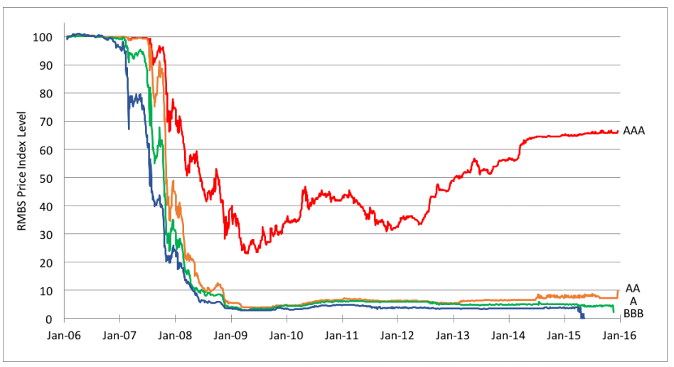
</div>

.font80[Source: Markit.]

---

## Dating the Financial Crisis

**Residential Mortgage-Backed Securities (RMBS) Fire Sale**: 
.font80[AAA-rated RMBS prices (as captured by the ABX.HE RMBS index) exhibit a classic fire sale]

<div align="center">
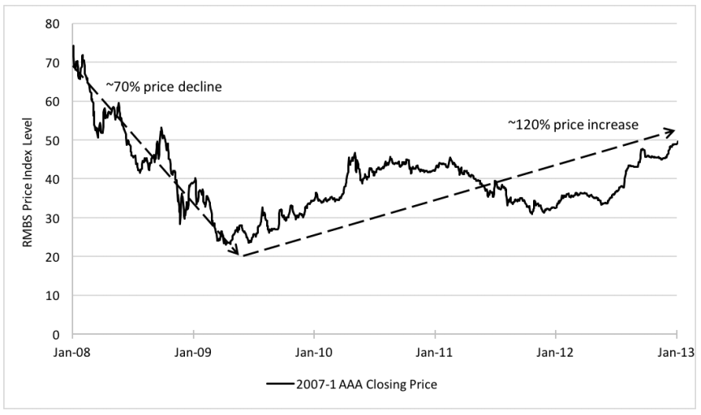
</div>

.font80[Source: Markit.]

---

## Dating the Financial Crisis

**Collapse of the Asset-Backed Commercial Paper Market**: .font80[The outstanding asset-backed commercial paper.]

<div align="center">
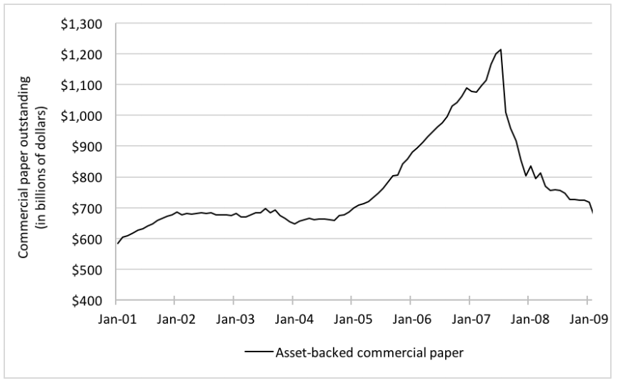
</div>

.font80[Source: Federal Reserve Bank of St. Louis (2017c, 2017d).]

---

## Dating the Financial Crisis

**Stock Market’s Reaction: S&P 500 Index**

```{r, echo=FALSE, warning=FALSE, message=FALSE, cache=FALSE, warning=FALSE, comment=FALSE}
library(ggplot2)
library(plotly)
library(stats)
library(graphics)
library(haven)
setwd("C:/Financial Economics/LectureNotes/")
sp <- read_dta("Data/Equity/GSPC_SP500.dta")
sp2 <- sp[which(sp$year >=2006 & sp$year <=2013), ]
p <- ggplot(sp2, aes(x=date, y=adjclose)) + geom_line(color = "#09557f") +
  labs(x = "Date", 
       y = "Adjusted Closing Price") +scale_x_date(date_breaks = "1 year", date_labels =  "%Y")+ theme(axis.text.x = element_text(angle = 45, vjust = 1, hjust=1))
#+ scale_x_date(date_breaks = "1 year", date_labels =  "%Y") 
#p
ggplotly(p)
```

---

## Dating the Financial Crisis

**Stock Market’s Expectation of Volatility**: .font80[Chicago Board Options Exchange Volatility Index (VIX),  computed using S&P 500 index options]

<div align="center">
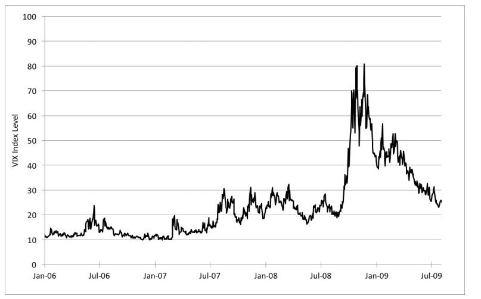
</div>

.font80[Source: Federal Reserve Bank of St. Louis (2017e).]


---

## Dating the Financial Crisis

**Money Market Fund Assets After Lehman**: .font80[Investors ran from prime money market funds that lent to holders of MBS toward government money market funds.]

<div align="center">
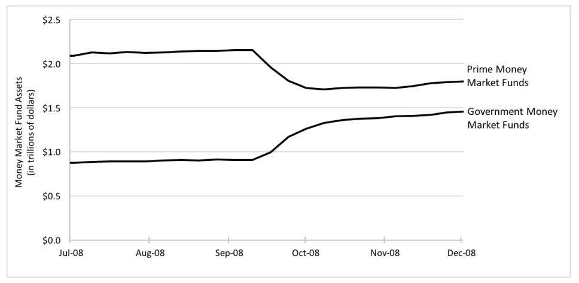
</div>

.font80[Source: Investment Company Institute.]


---

## What Do We Learn?

**Why Did The Crises of 2007-2009 Happen?** 

.font100[
- US housing bubble and the crisis of 2008 look like a standard credit boom (rapid credit growth, exuberant credit market sentiment) followed by a crisis and a recession

- It is also similar in patterns of expectations, with enthusiasm about housing and MBS supporting the credit boom

- Instability was caused from beliefs (excess optimism, lending and investment; correction of expectations due to bad news or waning of optimism; impaired intermediation or excess pessimism)
]

---

## What Do We Learn?

**Why Did Both Markets and Policy Makers Fail to Anticipate the Crash?** 


- .font100[Tail risks neglected by both investors and policy makers]


- .font100[The system was more interconnected – through derivatives and fire sales – than believed]


- .font100[Moral Hazard: too big to fail, limited skin in the game]

.content-box-purple["*If they are too big to fail, they are too big.*" - Alan Greenspan]


---

## The Eurozone Financial Crisis

### Transmission from the United States

.pull-left[

#### US Housing Bubble created by 

.font80[
- Low interest rates

- Lax regulation of sub-prime mortgages with adjustable rates, two year teaser rates

- Securitization of  mortgages, sold to unwary buyers as highly rated] 

#### US Bubble popped when

.font80[
- Interest rates rose in 2006, housing prices fell

- Subprime mortgages and securities defaulted]

]


.pull-right[

<div align="center">
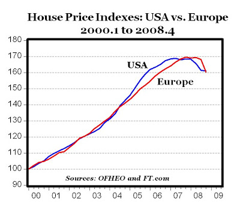
</div>

.font80[Source: [Mark J. Perry's Blog for Economics and Finance](http://mjperry.blogspot.com/2009/04/house-price-indexes-usa-vs-europe.html)]

]


---

## The Eurozone Financial Crisis

#### **European Crisis Began Later**
.font80[
- US Housing Prices peaked in late 2006

- European Housing Prices peaked a year later]

#### **International Credit Markets Froze Up**
.font80[
- International credit markets froze up in August 2007 when subprime based hedge funds collapsed in Europe and US.] 

#### **Wholesale Funding Dry-Ups**
.font80[
- No longer able to borrow short-term funds, banks faced much higher risk premia]


---

## The Eurozone Financial Crisis

### European Financial Institutions under Stress

- **BNP-Paribas** forced to close funds in August 2007

- UK bank **Northern Rock** taken over by government

- German state banks **IKB, WestLB, BayernLB and SachsenLB** bailed out by government

- Irish banks given government deposit guarantees

- Switzerland injects funds into **UBS**

- Iceland’s banks **Kaupthing Bank, Landsbanki, and Glitnir Bank** unable to roll over short term borrowing, default on deposits of foreigners


---

## The Eurozone Financial Crisis

### Severe Tensions in Global Financial Markets

<div align="center">

</div>

.font80[Notes: 12-month EURIBOR/LIBOR – OIS spreads (percent). LIBOR represents London Interbank Offered Rate. Euribor represents Euro Interbank Offered Rate. OIS represents Overnight Index Swap.]

.font80[Source: [ECB](https://www.ecb.europa.eu/press/key/date/2015/html/sp151027_slides.en.pdf?4854fa6ac26b4388f7d5086fc9b0b1c9)]


---

## The Eurozone Financial Crisis

### Why Did the Crisis Spread?

.pull-left[

.font80[
- Subprime Debt Obligations made in USA held around the world caused global financial shock. 

- Housing bubbles burst in UK , Ireland, Spain

- Failure of Lehman Brothers in September 2007 caused massive panic over counterparty risk.

- Stress on banks around the world led to shrinking credit availability. “Shadow” off-balance-sheet banking sector collapsed as short-term funding vanished.  

- Falling demand spread from US to all countries; as US imports dropped, other countries’ exports fell. ]

]

.pull-right[

<div align="center">
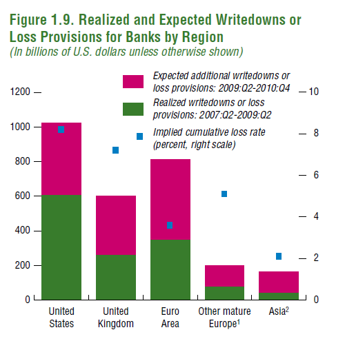
</div>

.font80[Source: IMF Global Financial Stability Report (2009)]

]


---

## The Eurozone Financial Crisis

.pull-left[
### Financial Sector Bailouts

.font80[

- National programs in European countries, due to absence of Eurozone-wide regulator.

- “Beggar-thy-neighbor” effect, as first Ireland gave deposit guarantees, then UK, then Netherlands, to avoid bank deposit flight.]


### Fiscal Stimulus 
.font80[

- Discretionary Fiscal Stimulus enacted in most countries, depending on their fiscal positions.

- Automatic Stabilizers of falling taxes, rising welfare and unemployment payments 
]

]

.pull-right[

<div align="center">
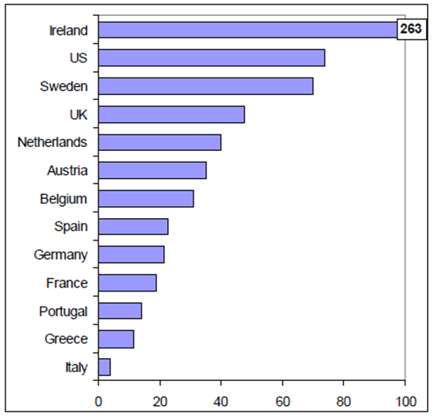
</div>

<div class="navy" align="center">
.font80[Public Support to the Financial Sector as of 18 February 2009 (% of GDP)] 
</div>

.font80[Source: IMF Global Financial Stability Report (2009)]

]

---

## The Eurozone Sovereign Debt Crisis

<div align="center">
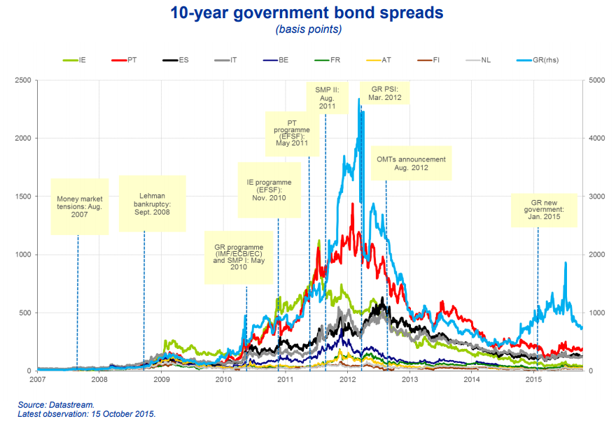
</div>

.font80[Notes: 10-year government bond spreads (basis points).]

.font80[Source: [ECB](https://www.ecb.europa.eu/press/key/date/2015/html/sp151027_slides.en.pdf?4854fa6ac26b4388f7d5086fc9b0b1c9)]


---

## The Eurozone Sovereign Debt Crisis

<div align="center">
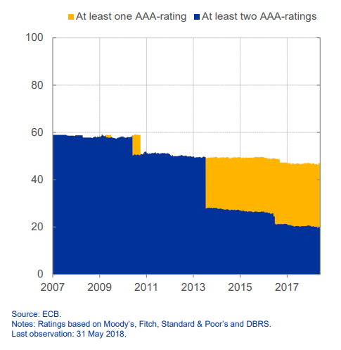
</div>

.font80[Notes: Share of euro area sovereign bonds with AAA rating (percent).]

.font80[Source: [ECB](https://www.ecb.europa.eu/pub/pdf/annex/ecb.sp180606_slides.en.pdf)]


---

## The Eurozone Financial Crisis

.pull-left[

### Monetary Policy

.font80[

- ECB injected liquidity into European banks unable to obtain short-term funds in market.

- Federal Reserve used Euro-dollar swaps to make dollars available to ECB to lend to banks.

- ECB did not lower interest rates until October 2008 because of its focus on inflation.

- Euro fell against the dollar due to “safe haven” flight to US Treasury securities.
]
]


.pull-right[

<div align="center">
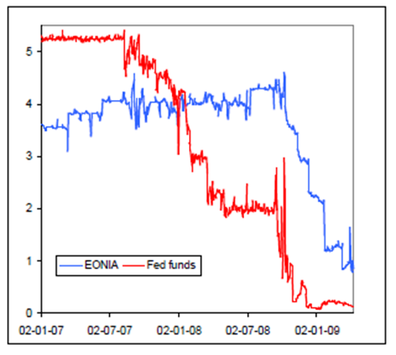
</div>

<div class="navy" align="center">
.font80[Interbank Rates in the Eurozone and the US] 
</div>

.font80[Source: Sources: ECB, Federal Reserve Bank of New York]

]

---

## The Eurozone Financial Crisis: Recap.

<br />

- Sovereign Debt Crises

- The Competitiveness Problem

- The Fiscal Problem

- The Banking Problem

---

## The Greek Debt Crisis

.pull-left[
### .font110[Greece’s Financial Problems]

.font80[

- High inflation since joining the euro

- Higher debt gowth than others to finance generous public sector, while collecting a lower share in taxes due to widespread tax evasion

- As a result, Greek goods have become increasingly expensive and uncompetitive, causing loss of market share and further reducing revenues

]

]

.pull-right[

.font80[

- Greek debt/GDP ratio reached 113% and deficit/GDP ratio reached 12.7% in 2009.


- Foreign bondholders became doubtful that Greece could continue to roll over its increasing debt, forced interest rates higher.

- EU faced choice between Greek default and bailout with tough conditions.

- IMF and EU agreed to lend Greece up to $146 billion over three years.

- Greece to increase sales taxes, reduce public sector salaries, pensions, eliminate bonuses

]

]


---

## The 2010-2014 Portuguese Financial Crisis


.font90[

- A sovereign crisis: government cannot finance its regular activities and functions

- Portugal before the crisis...

  - GDP declined by 5.3% between Q4-2010 and Q3-2012
  - Umemployment rate increased by 15.9%
  - Escalating national debt. Portugal recorded a Government Debt to GDP of 123.60 percent of the country's Gross Domestic Product in 2012.
  - Rising bond yields $\\$ Bond prices decreased $\\$ Panic selling

]

---

class: center, middle, inverse

# **Additional Materials**


---

## Financial Crisis Movies

.pull-left[

<iframe width="400" height="225" src="https://www.youtube.com/embed/Vh0piQN1_LY" frameborder="0" allow="accelerometer; autoplay; encrypted-media; gyroscope; picture-in-picture" allowfullscreen></iframe>

<div class="navy" align="center">
.font80[Source: 99 Homes]
</div>

<iframe width="400" height="225" src="https://www.youtube.com/embed/GD6JPD8tLmQ" frameborder="0" allow="accelerometer; autoplay; encrypted-media; gyroscope; picture-in-picture" allowfullscreen></iframe>

<div class="navy" align="center">
.font80[Source: Too Big To Fail]
</div>

]

.pull-right[

<iframe width="400" height="225" src="https://www.youtube.com/embed/IjZ-ke1kJrA" frameborder="0" allow="accelerometer; autoplay; encrypted-media; gyroscope; picture-in-picture" allowfullscreen></iframe>

<div class="navy" align="center">
.font80[Source: Margin Call]
</div>


<iframe width="400" height="225" src="https://www.youtube.com/embed/GrqP3l9iZnc" frameborder="0" allow="accelerometer; autoplay; encrypted-media; gyroscope; picture-in-picture" allowfullscreen></iframe>

<div class="navy" align="center">
.font80[Source: The Company Men]
</div>

]

---


## Financial Crisis Documentaries

.pull-left[

<iframe width="400" height="225" src="https://www.youtube.com/embed/Dzs3Xwnf9Pw" frameborder="0" allow="accelerometer; autoplay; encrypted-media; gyroscope; picture-in-picture" allowfullscreen></iframe>

<div class="navy" align="center">
.font80[Source: Inside Job]
</div>


<iframe width="400" height="225" src="https://www.youtube.com/embed/0yZ5mjbB11I" frameborder="0" allow="accelerometer; autoplay; encrypted-media; gyroscope; picture-in-picture" allowfullscreen></iframe>

<div class="navy" align="center">
.font80[Source: Meltdown]
</div>

]

.pull-right[

<iframe width="400" height="225" src="https://www.youtube.com/embed/qlSxPouPCIM" frameborder="0" allow="accelerometer; autoplay; encrypted-media; gyroscope; picture-in-picture" allowfullscreen></iframe>

<div class="navy" align="center">
.font80[Source: 1929 and the Great Depression]
</div>


<iframe width="400" height="225" src="https://www.youtube.com/embed/MHpnhPEce_I?list=PLLOBC2RVibzv6DJFVz9X4mS3_rUlB3UKr" frameborder="0" allow="accelerometer; autoplay; encrypted-media; gyroscope; picture-in-picture" allowfullscreen></iframe>

<div class="navy" align="center">
.font80[Source: The Crash of 1987]
</div>

]


---

## Financial Crisis Documentaries

.pull-left[

<iframe width="400" height="225" src="https://www.youtube.com/embed/V5iE-4JsUms" frameborder="0" allow="accelerometer; autoplay; encrypted-media; gyroscope; picture-in-picture" allowfullscreen></iframe>

<div class="navy" align="center">
.font80[Source: Dot Com Bubble]
</div>


]

.pull-right[


<iframe width="400" height="225" src="https://www.youtube.com/embed/aq1Ln1UCoEU" frameborder="0" allow="accelerometer; autoplay; encrypted-media; gyroscope; picture-in-picture" allowfullscreen></iframe>

<div class="navy" align="center">
.font80[Source: Flash Crash 2010]
</div>

]

  
---

## [GameStop](https://finance.yahoo.com/quote/GME/)

- A war between small retail investors and institutional investors

- Forcing institutional investors who bet against the company to back out -- performing what's known as a "short squeeze."

<blockquote>
Short squeeze is the phenomenon where short sellers are forced to repurchase stock as prices rise, thereby pushing the price higher.
</blockquote>

<br />

.font100[
*A short squeeze occurs when a stock or other asset jumps sharply higher, forcing traders who had bet that its price would fall, to buy it in order to forestall even greater losses. Their scramble to buy only adds to the upward pressure on the stock's price.*
]


