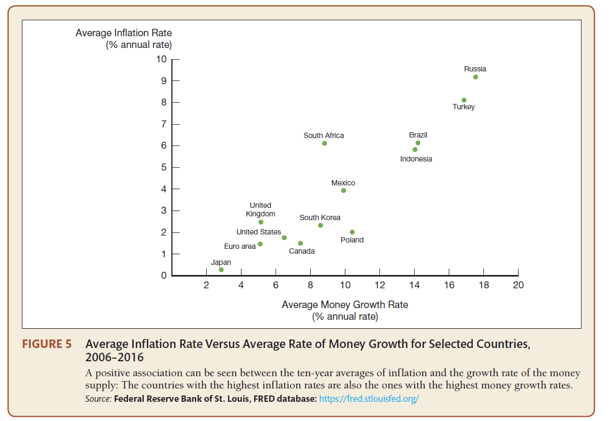
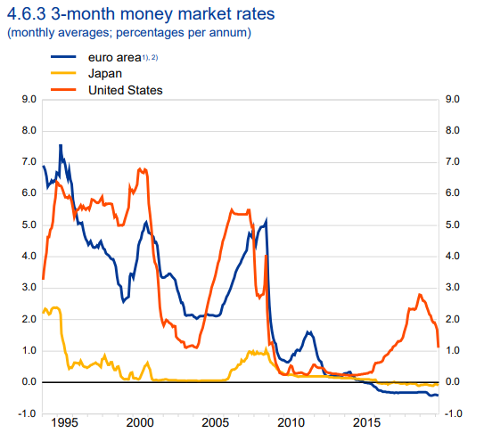

```{r, echo=FALSE, message=FALSE, warning=FALSE}
setwd("F:/Financial Economics/LectureNotes/")
```


## Outline

### 

### Money Market

### Central Banks and Monetary Policy

### Money Market Interest Rates


#### **Reading Materials**: The Economics of Money, Banking, and Financial Markets 12ed. (Mishkin): Chapter 3, Chapter 5, Chapter 13-Chapter 16

#### **Quiz**


---

class: center, middle, inverse


# **Money Market**

---

##  What Is Money?

<div align="center">

</div>

<div align="center">
.bold[Barter Economy and Transaction Cost]
</div>
.font80[
If there are 5 goods in a barter economy, how many prices one needs to know in order to exchange one good for another?

N(N-1)/2) -> 10
]

---

## Primary Functions of Money

### **Medium of Exchange**

Money promotes economic efficiency by minimizing the time spent in exchanging goods and services

### **Unit of Account**

Money is used to measure value in an economy

### **Store of Value**

Money is a repository of purchasing power available over time (e.g., from the time income is received until the time it is spent)


---

## What Is Money?

<div align="center">

</div>


---

## What Is Money?

.pull-left[
<div align="center">

</div>
]


.pull-right[
<div align="center">

</div>
]


---

## What Is Money?

- Mishkin (2018)
.font80[
<blockquote>
Money is anything that is generally accepted as payment for goods or services or in the repayment of debts.
</blockquote>
]

- Irving Fisher:  "*The Purchasing Power of Money II, 1*"
.font80[
<blockquote>
We define money as what is generally acceptable in exchange for goods. The facility with which it may thus be exchanged, or its general acceptability, is its distinguishing characteristic. The general acceptability may be reenforced by law, the money thus becoming what is known as "legal tender"; but such reenforcement is not essential.” 
</blockquote>
]

- Milton Friedman
.font80[
<blockquote>
The pieces of green paper have value because everyone thinks they have value.
</blockquote>
]


- Money is the most liquid asset of all
.font80[
<blockquote>
.bold[Liquidity]: the relative ease and speed with which an asset can be converted into a medium of exchange.
</blockquote>
]

---

## Measuring Money

### Monetary Aggregates

.font80[
<blockquote>
M1: the most liquid assets (high liquidity and medium of exchange). 
</blockquote>

1. Currency
2. Checkable deposits

]

.font80[
<blockquote>
M2: near-money accounts (medium liquidity, store of value, interest-bearing, below $100,000). 
</blockquote>

1. Money market deposit accounts and money market mutual fund shares

2. Savings deposits and small-denomination time deposits

]

.font80[
<blockquote>
M3: near-money accounts (low liquidity, unite of account, above $100,000). 
</blockquote>
]


???
M1
1. Currency (paper money and coins in the hands of the nonbank public)
2. Checking account deposits (checking accounts, debit accounts; business checking accounts that do not pay interest, traveler’s checks issued by banks)
3. Traveler’s checks not issued by banks

M2
1. Assets that have check-writing features (money market deposit accounts and money market mutual fund shares) 

2. Other assets (savings deposits and small-denomination time deposits)


---

## Money Demand

.pull-left[
.font80[
-  How much money to hold depends on the relative costs and benefits of holding money versus other assets


<blockquote>
.bold[Opportunity Cost]: the amount of interest (expected return) sacrificed by not holding the alternative asset
</blockquote>

**3 Motives: John Maynard Keynes (1936)**

.font100[Transaction

Precautionary/Asset

Speculative]

**3 Shifters**

.font100[Price Level

Real GDP

Transaction Costs]

]

]

.pull-right[

```{r, echo=FALSE, warning=FALSE, message=FALSE, cache=FALSE, warning=FALSE, comment=FALSE}
library(dplyr)
library(ggplot2)

demand <- Hmisc::bezier(c(1, 5, 9),
                        c(9, 5, 1)) %>%
  as_data_frame()

supply <- Hmisc::bezier(x = c(5, 5, 5),
                        y = c(0, 5, 10)) %>%
  as_data_frame()

p <- ggplot(demand, aes(x = x, y = y)) + 
  geom_path(data = demand, color = "#0073D9", size = 1) + 
  labs(x = "Quantity of Money", y = "Norminal Interest Rate")
p <- p + annotate("text", x = 8, y = 0.5, label = "Money Demand", colour = "#0073D9", fontface =3)
p

```
]

---

## Money Supply


```{r, echo=FALSE, warning=FALSE, message=FALSE, cache=FALSE, warning=FALSE, comment=FALSE}
library(dplyr)
library(ggplot2)

demand <- Hmisc::bezier(c(1, 5, 9),
                        c(9, 5, 1)) %>%
  as_data_frame()

supply <- Hmisc::bezier(x = c(5, 5, 5),
                        y = c(0, 5, 10)) %>%
  as_data_frame()

p <- ggplot(supply, aes(x = x, y = y)) + 
  geom_path(data = supply, color = "#FF4036", size = 1) +
  labs(x = "Quantity of Money", y = "Norminal Interest Rate")
p <- p + annotate("text", x = 5, y = 10.2, label = "Money Supply", colour = "#FF4036", fontface =3)
p

```


.font100[**Shifters: Tools of Monetary Policies**]


---

## Money Market

.pull-left[

-  Interest Rate: The Price of Borrowing Money

.font80[.content-box-purple[
**John Maynard Keynes (1936): The Liquidity Preference Framework**

**Key Assumption**: .font80[

(1) Total wealth in the economy must equal the total quantity of bonds plus money in the economy. 

(2) Money has zero rate of return.

]
]

$$B^s + M^s=B^d + M^d$$

$$B^s - B^d=M^d-M^s$$

<blockquote>
.font100[An excess supply of bonds implies an excess demand for money]
</blockquote>
]


]


.pull-right[

**The Money Market Graph**

.font80[Mishkin (2018), Figure 8, Chapter 5]

<div align="center">

</div>

]


---

### How Does the Equilibrium Interest Rate Change?

.pull-left[
**Shifts in the Demand for Money**
.font80[
- .content-box-purple[Income Effect]: higher income --> demand curve shifts to the right --> interest rates rise

- .content-box-purple[Price-Level Effect]: higher price level --> demand curve shifts to the right  --> interest rates rise
]

**Shifts in the Supply of Money**
.font80[
- .content-box-purple[Money Supply Effect]: supply curve shifts to the right --> interest rates decline
]

]


.pull-right[

.font80[Mishkin (2018), Table 4, Chapter 5]

<div align="center">

</div>

]


---


### Will Increase in Money Supply Always Lower Interest Rates?

<blockquote>
.font100[**The Liquidity Effect**: *An increase in the money supply (**everything else remaining equal**) lowers interest rates.*]
</blockquote>


<blockquote>
.font100[**Milton Friedman**: *An increase in the money supply might not leave “everything else equal” and will have **other effects** on the economy that may make interest rates rise.*]
</blockquote>


---

### Will Increase in Money Supply Always Lower Interest Rates?

.pull-left[

.bold[More than Liquidity Effect]

- .content-box-purple[.font80[Income Effect]]: .font80[money supply increases --> income increases --> interest rates increase]

- .content-box-purple[.font80[Price-Level Effect]]: .font80[money supply increases --> overall price level increases --> interest rates increase]

- .content-box-purple[.font80[Expected-Inflation Effect]]: .font80[money supply increases --> overall price level increases --> expected inflation rate increases --> interest rates increase]

.font80[.red[**Which effect dominates depends critically on how fast people’s expectations about inflation adjust.**]]


]


.pull-right[

<div align="center">

</div>

.font80[Source: Mishkin (2018), Figure 11, Chapter 5]

]


---

#### [Money and Inflation](https://fred.stlouisfed.org/series/GDPDEF)


```{r, echo=FALSE, warning=FALSE, message=FALSE, cache=FALSE, warning=FALSE, comment=FALSE}
library(ggplot2)
library(plotly)
library(stats)
library(graphics)
library(haven)

setwd("F:/Financial Economics/LectureNotes/")
# The palette with black:
cbbPalette <- c("blue", "darkred")
sp <- read_dta("Data/Money/money_inflation.dta")
sp2 <- sp[which(sp$year >=1960 & sp$year <=2020), ]
p <- ggplot(sp2, aes(x=date, y=index, group=Instrument, colour=Instrument)) + 
  geom_line(size=0.6)+ labs(x = "Date", y = "index")+scale_fill_manual(values=cbbPalette)+scale_colour_manual(values=cbbPalette)+scale_x_date(date_breaks = "2 year", date_labels =  "%Y") +  theme(legend.position = "none", axis.text.x = element_text(angle = 45, vjust = 1, hjust=1))

p <- p + annotate("text", x = as.Date("2005-01-01"), y = 160, label = "M2 Money Supply", colour = "darkred", fontface =3) + annotate("text", x = as.Date("2015-01-01"), y = 90, label = "GDP Defaltor", colour = "blue", fontface =3)

#p
ggplotly(p)

```


---

#### [Money and Inflation](https://fred.stlouisfed.org/series/GDPDEF)


<div align="left">

</div>


---

#### [Money and Interest Rates](https://fred.stlouisfed.org/series/GS10)

```{r, echo=FALSE, warning=FALSE, message=FALSE, cache=FALSE, warning=FALSE, comment=FALSE}
library(ggplot2)
library(plotly)
library(stats)
library(graphics)
library(haven)

setwd("F:/Financial Economics/LectureNotes/")
sp <- read_dta("Data/Money/money_interest.dta")
sp2 <- sp[which(sp$year >=1960 & sp$year <=2020), ]
p <- ggplot ()+geom_line(mapping = aes(x = sp2$date, y = sp2$gs10), size = 0.6, color = "darkred")+geom_line(mapping = aes(x = sp2$date, y = sp2$tb3ms), size = 0.6, color = "black")+geom_line(mapping = aes(x = sp2$date, y = sp2$m2sl_growth), size = 0.6, color = "blue") + 
  scale_x_date(date_breaks = "2 year", date_labels =  "%Y", name = "Date")+
  scale_y_continuous(name = "Interest Rate (%)", 
                     sec.axis = sec_axis(~./1, name = "Money Growth (% Annual Rate)")) +  theme(legend.position = "none", axis.text.x = element_text(angle = 45, vjust = 1, hjust=1))

p <- p + annotate("text", x = as.Date("2009-01-01"), y = -0.5, label = "3-Month Treasury Bill Yield", colour = "black", fontface =3) + annotate("text", x = as.Date("2000-01-01"), y = 12, label = "10-Year Treasury Bond Yield", colour = "darkred", fontface =3) + annotate("text", x = as.Date("1972-01-01"), y = 14, label = "Money Growth", colour = "blue", fontface =3)

ggplotly(p)
```


---

## Q & A


.pull-left[

<div align="center">

</div>

]


.pull-right[

<div align="left">
.font100[[Milton Friedman](https://www.econlib.org/library/Enc/bios/Friedman.html), a staunch supporter of free markets and a critic of changes in the price level, argued that government monetary authorities ought to increase the money supply at some known, constant rate. 

If Friedman was so worried about price level changes, why didn’t he advocate permanently fixing the money supply (MS)?]
</div>

]


---

class: center, middle, inverse

# **Central Banks and Monetary Policy**

---

## Central Banks

**The government agency that oversees the banking system, manages the currency, and is responsible for the conduct of monetary policy.**

.font80[
- Bank of England: founded in 1694, model of all of the central banks in the world, formally independent since 1997

- US 

  - Suffolk system (1819-1860)

  - National banking Act: passed in 1863, revision in 1864, fixed bank notes problem

  - Federal Reserve System:  the central banking system of the United States of America, founded in 1913

- European Central Bank (ECB) and European System of Central Banks (ESCB): founded in 1998 (Maastricht Treaty 1992)

- Bank of Japan: became independent in 1997

- Banco de Portugal: founded in 1846, nationalised in 1975 then became responsible for the supervision of the banking system

- Banco de Espanã: founded in 1782, nationalised in 1962
]


---

## Federal Reserve System

#### Governed by the board of governors or Federal Reserve Board (FRB) with seven members 

#### Twele regional Federal Reserve Banks regulate and oversee privately owned commercial banks of their region

#### [Federal Open Markets Committee (FOMC)](https://www.federalreserve.gov/monetarypolicy.htm): .font90[sets monetary policy and makes key decisions about a [range](https://fred.stlouisfed.org/series/DFEDTARU) of the interest rate - [Federal Funds Rates](https://fred.stlouisfed.org/series/FEDFUNDS) (Overnight, Unsecured) and the growth of the United States money supply.]

- .font80[Current Target Rate: 0.00-0.25]

- .font80[[Current Federal Funds rate](https://apps.newyorkfed.org/markets/autorates/fed%20funds)]


---

## ECB, ESCB and the Eurosystem

- 1 January, 1999: the European Central Bank (ECB) started to take the responsibility for conducting monetary policy for the euro area.

- The responsibility for monetary policy was transferred from the national central banks of 11 EU Member States to the ECB. 

- Now 19 countries have joined the euro area
   - Greece joined in 2001
   - Slovenia in 2007 
   - Cyprus and Malta in 2008
   - Slovakia in 2009
   - Estonia in 2011
   - Latvia in 2014
   - Lithuania in 2015
   
   
---

## ECB, ESCB and the Eurosystem

**European Central Bank (ECB)**: The core of the Eurosystem and the ESCB. The ECB and the national central banks together perform the tasks they have been entrusted with.

**European System of Central Banks (ECSB)**: The ESCB comprises the ECB and the national central banks (NCBs) of all EU Member States whether they have adopted the euro or not.

**Eurosystem**: The Eurosystem comprises the ECB and the NCBs of those countries that have adopted the euro. 

**Euro area**: The euro area consists of the EU countries that have adopted the euro.


???
The Eurosystem and the ESCB will co-exist as long as there are EU Member States outside the euro area.


---

## Monetary Policy

<blockquote>
.font80[**Monetary Policy**: the use of the money supply to influence macroeconomic aggregates, such as output, inflation, and unemployment]
</blockquote>


<blockquote>
.font80[**Contractionary Monetary Policy**: monetary policy designed to decrease aggregate demand, decrease output, and increase unemployment]
</blockquote>


<blockquote>
.font80[**Expansionary Monetary Policy**: monetary policy designed to increase aggregate demand, increase output, and decrease unemployment]
</blockquote>


<blockquote>
.font80[**Policy Interest Rate**: the interest rate on overnight loans from one bank to another, e.g., i.e., Federal Funds Rate, LIBOR, SHIBOR]
</blockquote>

<blockquote>
.font80[**Discount Rate**: i.e., The interest rate charged by the Fed on the reserves borrowed from the Fed]
</blockquote>

???

Because money affects many economic variables that are important to the well-being of our economy, politicians and policymakers throughout the world care about the conduct of monetary policy, the management of money and interest rates. The organization responsible for the conduct of a nation’s monetary policy is the central bank.

Fiscal policy involves decisions about government spending and taxation. budget deficit vs. budget surplus


---

## [Tools of Monetary Policy](https://www.federalreserve.gov/monetarypolicy/policytools.htm)

- .content-box-purple[Reserve Requirements] 

   Reserve requirements Increases --> federal funds rate increases
   

- .content-box-purple[Open Market Operations (OMOs)] 

   Purchase/Sale --> federal funds rate decreases/increases

<blockquote>
.font80[OMOs involve buying and selling of securities, such as bonds, by a central bank to change the money supply. It's the most important monetary policy tool prior to 2008]
</blockquote>


- .content-box-purple[Discount Rate] 

   Discount rate increases --> federal funds rate increases
   
???
Open market operations target the rate that banks charge other banks, usually for very short-term loans.

It might sound weird that a bank would want to borrow money from another bank, but it happens all the time. For example, sometimes banks have an unexpected withdrawal and fall below their required reserves. A bank could borrow money from another bank with excess reserves to meet that requirement. A bank might have a customer that wants to borrow money from it, but doesn’t have the excess reserves to do so. That bank can borrow money from another bank that does have excess reserves, and then make the loan to its customer


---

## Tools of Monetary Policy
   

- .content-box-purple[Interest on Reserves (IOR)]: A new tool after the Crisis

   IOR increases --> federal funds rate increases
   
   - The 2008 Emergency Economic Stabilization Act (EESA) Allows Fed to pay interests on bank's reserves which fundamentally changed the world!


[Interest Rate on Required Reserves](https://fred.stlouisfed.org/series/IORR)

[Interest Rate on Excess Reserves](https://fred.stlouisfed.org/series/IOER)


---

## Tools and Outcomes of Monetary Policy 

.font80[
| |  Recessionary Gaps|   Inflationary Gaps| 
| :--- | :--- | :--- | 
| Objective | full employment  | price stability  |
| How | expansionary monetary policy <br/>  increase money supply   | contractionary monetary policy <br/>  decrease the money supply  |
| Tools used (primary tool in bold) | 1) **open market purchases (buy bonds)** <br/>  2) decrease discount rate <br/> 3) decrease reserve ratio  | 1) **open market sales (sell bonds)** <br/> 2) increase discount rate <br/> 3) increase reserve ratio  |
| Impact on interest rates (n.i.r.) | decrease nominal interest rate  | increase the nominal interest rate  |
| Impact on output (Y) | increase real output  | decrease real output  |
| Impact on price level/inflation (PL) | inflation increases  | inflation decreases  |
| Impact on unemployment (UR) | unemployment decreases  | unemployment increases  |
|  | MS ↑ → n.i.r. ↓ → I ↑ → AD ↑ → (Y ↑ PL ↑ UR ↓) | MS ↓ → n.i.r. ↑ → I ↓ → AD ↓ → (Y ↓ PL ↑ UR ↓) |
]

---

## Limitations of Monetary Policy

### .font90[Monetary policy, like fiscal policy, suffers from lags that might hamper how effective it can be at closing an output gap]

- It takes time to recognize that there is a problem in the economy and react

- The impact of the interest rate change takes time (e.g., changes in the overnight rate to pass through to other interest rates)


---

## Reserve Requirements

The minimum amount of reserve that banks must hold as a function of deposits (transaction accounts).

.font80[

Fed's reserve requirement table as of January 17, 2019

|  Deposit|   Requirement rate| 
| :--- | :--- | 
| more than $124.2 million  | 10%  |
| more than $16.3 million up to $124.2 million  |  3% |
| more than $16.3 million or less  |  0% |

]


<div align="center">

</div>

<div class="navy" align="center">
.font80[Source: Mishkin (2018)]
</div>

.font80[Monetary Base = Currency in Circulation + Reserves]


---

## Capital Requirements

Basel III: The minimum amount of capital that banks must hold as a function of **risk weighted assets (RWA)**. 

.font80[

| Capital | Requirement | 
| :--- | :--- | 
| common equity requirement  | 4.5%  |
| capital conservation buffer  |  2.5% |
| another buffer  |  2.5% |

]


*Reserve requirements are non-binding for most banks now. Capital requirement are more likely to be binding.*


---

##  Money Multiplier

What multiple of the monetary base is transformed into the money supply

### **A Simple Model**

$$ \Delta{D} =\frac{1}{rr} \times \Delta{R}$$

.font90[where $\Delta{D}$ = change in total checkable deposits in the banking system;
      rr = required reserve ratio; 
      $\Delta{R}$ = change in reserves for the banking system.]

      
- **Assumption**: Banks do not hold on to any excess reserves


---

##  Money Multiplier

### **Other Players**

*The simple model assumes that Federal Reserve is able to exercise complete control over the level of checkable deposits by setting the required reserve ratio and the level of reserves.*

- **Depositors**

*What if some proceeds from loans are not deposited in banks but instead are used to raise the holdings of currency?*

- **Banks**

*What if Banks decide to hold on excess reserves?*


---

##  Money Multiplier

.font90[
$$m = \frac{M}{MB}$$

.font90[m= money multiplier; 
M = money supply; 
MB = monetary base]


$$MB = R + C = RR + ER + C = (rr\times{D}) + ER + C$$ 

$$MB = (rr\times{D}) + (e\times{D}) + (c\times{D}) = (rr + e + c)\times{D} = (rr + e + c)\times{D}$$ 

$$M = M1 = D + C = D + c\times{D} = (1+c)\times{D}$$

$$m = \frac{M}{MB} = \frac{(1+c)\times{D}}{(rr + e + c)\times{D}} =\frac{1+c}{rr+e+c} $$
.font90[R= total reserves; 
RR = required reserves; 
ER = excess reserves;
D = checkable deposits;
rr = required reserve ratio;
C = currency;
e = ER/D;
c = C/D]

]


???
Open market operations change the non-borrowed monetary base, but the impact on the money supply is larger due to the money multiplier

We can use the money multiplier to predict the maximum change in the money supply that will occur as a result of the OMO. If the money multiplier is 4, then the money supply will increase by up to \$4{,}000$4,000dollar sign, 4, comma, 000.

---

## New Regimes of Monetary Policy 

### Unconventional Monetary Policy: Non–Interest-Rate Tools

.font90[

- Liquidity Provision through Discount Window Expansion; 

- Term Auction Facility; 

- New Lending Programs (TAF, TSLF, PDCF, AMLF, MMIFF, CPFF, and TALF.)

- Large-Scale Asset Purchases (MBS, long-term Treasury securities, continous purchase in QE3)

- Quantitative Easing

  - Used when interest rates are already near 0 percent and can be focused on the purchase of **government bonds and other financial assets** from banks
  
  - Objective is to shore up bank liquidity and lift inflation

]


**These led to expansion of the Federal Reserve’s balance sheet from about $900 billion to over $4 trillion by 2017**

---

#### Quantitative Easing and the Stock Market

<div align="center">

</div>

.font80[Source: [Quantitative Easing and S&P 500](https://www.hedgespa.com/2013/12/12/2014-qe-tapering-timeline/)]


---

#### Quantitative Easing and the Money Supply

```{r, echo=FALSE, warning=FALSE, message=FALSE, cache=FALSE, warning=FALSE, comment=FALSE}
library(ggplot2)
library(plotly)
library(stats)
library(graphics)
library(haven)

setwd("F:/Financial Economics/LectureNotes/")
# The palette with black:
cbbPalette <- c("blue", "darkred")
sp <- read_dta("Data/Money/MonetaryBase_Supply.dta")
sp2 <- sp[which(sp$year >=2006 & sp$year <=2020), ]
p <- ggplot(sp2, aes(x=date, y=amount, group=Instrument, colour=Instrument)) + 
  geom_line(size=0.6)+ labs(x = "Date", y = "$ Billions")+scale_fill_manual(values=cbbPalette)+scale_colour_manual(values=cbbPalette)+scale_x_date(date_breaks = "1 year", date_labels =  "%Y") +  theme(legend.position = "none", axis.text.x = element_text(angle = 45, vjust = 1, hjust=1))

p <- p + annotate("text", x = as.Date("2011-01-01"), y = 2800, label = "Monetary Base", colour = "darkred", fontface =3) + annotate("text", x = as.Date("2013-01-01"), y = 2000, label = "M1", colour = "blue", fontface =3)


#p
ggplotly(p)

```


---

#### Excess Reserves and Currency Ratio

```{r, echo=FALSE, warning=FALSE, message=FALSE, cache=FALSE, warning=FALSE, comment=FALSE}
library(ggplot2)
library(plotly)
library(stats)
library(graphics)
library(haven)

setwd("F:/Financial Economics/LectureNotes/")
# The palette with black:
cbbPalette <- c("blue", "darkred")
sp <- read_dta("Data/Money/ExcessReserve_Currency.dta")
sp2 <- sp[which(sp$year >=2006 & sp$year <=2020), ]
p <- ggplot(sp2, aes(x=date, y=amount, group=Instrument, colour=Instrument)) + 
  geom_line(size=0.6)+ labs(x = "Date", y = "$ Billions")+scale_fill_manual(values=cbbPalette)+scale_colour_manual(values=cbbPalette)+scale_x_date(date_breaks = "1 year", date_labels =  "%Y") +scale_y_continuous(limits=c(0, 2))+  theme(legend.position = "none", axis.text.x = element_text(angle = 45, vjust = 1, hjust=1))

p <- p + annotate("text", x = as.Date("2011-01-01"), y = 1.7, label = "Excess Reserves", colour = "darkred", fontface =3) + annotate("text", x = as.Date("2013-01-01"), y = 0.7, label = "Currency Ratio", colour = "blue", fontface =3)


#p
ggplotly(p)

```


---

## [Monetary Policy Tools of ECB](https://www.ecb.europa.eu/mopo/html/index.en.html)

### Conventional measures

- **Open Market Operations**
.font80[
  
   - Implemented through the individual national central banks
   
   - Main refinancing operations
   
   - reverse transactions (Repo and Reverse Repo)
   
   - Longer-term refinancing operations
   
]

- **Lending to Banks**
.font80[
   - Marginal lending facility (marginal lending rate - 100 basis points above the target financing rate
]
  
- **Interest on Reserves**
.font80[
   - ECB set the interest rate on reserves to negative values starting in June 2014
   
   - Reserve Requirements: 2%
]

---

## Monetary Policy Tools of ECB

### Unconventional measures

- **Very Long-Term Refinancing Operations (VLTROs)**: December, 2011 and February 2012

- **Outright Monetary Transactions (OMT)**: September, 2012, presented by Mario Draghi's (July 2012) commitment to do "whatever it takes" to preserve the euro.

- **Negative Interest Rate on the Deposit Facility**: June, 2014

- **Targeted Longer-Term Refinancing Operations (TLTROs)**: TLTROs (June, 2014), TLTRO II (March, 2016) and TLTRO III (March, 2019)

- **Asset Purchase Programme (APP)**: corporate sector purchase programme (CSPP), public sector purchase programme (PSPP), set-backed securities purchase programme (ABSPP), third covered bond purchase programme (CBPP3) in mid-2014

- [**Forward guidance**](https://www.ecb.europa.eu/explainers/tell-me/html/what-is-forward_guidance.en.html) since July, 2013


---

## Monetary Policy Tools of ECB

### Asset Purchase Programme


<div align="center">

</div>

.font80[Notes: The average monthly APP targets were first set by the ECB Governing Council at the beginning of the PSPP in March 2015.]

.font80[Source: [ECB](https://www.ecb.europa.eu/mopo/implement/omt/html/index.en.html)]


---

## New Regimes of Monetary Policy 


### Negative Interest Rates on Banks’ Deposits
.font90[
- Central bank of Sweden: July 2009

- Central bank of Denmark: July 2012

- ECB: June 2014

- Central bank of Switzerland: December 2014 

- Bank of Japan: January 2016

*There are critics that negative interest rates on deposits may have contractionary effect.*
]

---

## New Regimes of Monetary Policy

.pull-left[


<iframe width="560" height="315" src="https://www.youtube.com/embed/KIslBZxp5zQ" frameborder="0" allow="accelerometer; autoplay; encrypted-media; gyroscope; picture-in-picture" allowfullscreen></iframe>

<div class="navy" align="center">
6 May, 2019
</div>
]

.pull-right[


<iframe width="560" height="315" src="https://www.youtube.com/embed/FiYTmTHFa9E" frameborder="0" allow="accelerometer; autoplay; encrypted-media; gyroscope; picture-in-picture" allowfullscreen></iframe>

<div class="navy" align="center">
1 Nov, 2019
</div>

]


---

class: center, middle, inverse

# **Money Market Interest Rates**

---
  
## Money Market Instruments
  
- **Money Market: Short-Term (maturity < 1 year)**

.font80[
| Instrument|  Main Features| 
| :--- | :--- | 
| *U.S. Treasury bills* | no interest payments, sell at a discount, very liquid, indicator of general interest-rate movements  |
| *Negotiable bank certificates of deposit (CD)* | important source of funds for commercial banks |
| *Commercial paper* | short-term debt instrument issued by large banks and well-known corporations |
| *Repurchase agreements (repos)* | short-term loans for which Treasury bills serve as collateral |
| *Federal funds* | overnight loans between banks of their deposits at the Federal Reserve |
]  


---

## Market for Reserves

- The market for reserves is where the federal funds rate is determined

- The quantity of reserves demanded by banks: required reserves + excess reserves

- The cost of holding excess reserves is the opportunity cost — the interest rate that could have been earned on lending these reserves out minus the interest rate that is earned on these reserves

---

## The Federal Funds Market

<div align="center">

</div>

.font80[Source: Mishkin (2018), Figure 1, Chapter 15]

  
---

## Money Market Interest Rates

.font80[
| Interest Rate|  Main Features| 
| :--- | :--- |
| *Treasury bill rate* | The interest rate on U.S. Treasury bills, indicator of general interest-rate movements |
| *Prime rate* | The base interest rate on corporate bank loans, indicator of the cost of businesses borrowing from banks  |
| *Federal funds rate* | The overnight lending interest rate banks charge one another to borrow money, indicator of the cost to banks of borrowing funds from other banks and the stance of monetary policy |
| *Libor rate* | The British Banker’s Association average of interbank rates for dollar deposits in the London market |
| *Euribor rate* | The Euro Interbank Offered Rate, based on the interest rates at which a panel of European banks borrow funds from one another |  
| *Eonia* | Euro OverNight Index Average, the 1-day interbank interest rate for the Euro zone. |

]

???
Euribor, or the Euro Interbank Offer Rate, is a reference rate that is constructed from the average interest rate at which eurozone banks offer unsecured short-term lending on the inter-bank market. The maturities on loans used to calculate Euribor often range from one week to one year.

---

##  [Federal Funds Rates](https://fred.stlouisfed.org/series/FEDFUNDS)

- Borrowing and lending in the federal funds market established the federal funds rate.

- The Fed tried to affect the federal funds rate by conducting open market operations and through this tool affect the credit conditions and the rest of the economy.

##  [Libor Rates](https://www.global-rates.com/interest-rates/libor/libor.aspx)

- LIBOR (London Inter-bank Offered Rate) is the average interbank interest rate at which a selection of banks on the London money market are prepared to lend to one another.

- LIBOR comes in 7 maturities (from overnight to 12 months) and in 5 different currencies.

- LIBOR is considered as the most important benchmark in the world for short-term interest rates


???
 Although reference is often made to the LIBOR interest rate, there are actually a lot of different LIBOR interest rates. LIBOR is calculated for 7 different maturities and for 5 different currencies. The official LIBOR interest rates are announced once a day at around 11:45 a.m. London time by ICE Benchmark Administration (IBA). 

???
LIBOR is watched closely by both professionals and private individuals because the LIBOR interest rate is used as a base rate (benchmark) by banks and other financial institutions. Rises and falls in the LIBOR interest rates can therefore have consequences for the interest rates on all sorts of banking products such as savings accounts, mortgages and loans.


---

##  [Euribor Rates](https://www.euribor-rates.eu/en/euribor-charts/)

The Euribor (Euro Interbank Offered Rate) rates are based on the interest rates at which [a panel of 20 European banks](https://www.euribor-rates.eu/en/panelbanks/) with the highest volume of business in the euro zone money borrow funds from one another.


##  [Eonia](https://www.euribor-rates.eu/en/eonia/)

Eonia (European Overnight Index Average) is a weighted average of the interest rates on unsecured overnight lending transactions denominated in euros, as reported by a panel of contributing banks.
.font80[
- Both Euribor and Eonia are offered by the European Money Markets Institute ([EMMI](https://www.emmi-benchmarks.eu/emmi/)).
- Eonia is an overnight rate, while Euribor is the interbank lending rate at various maturities.
- Euribor is calculated by Global Rate Set Systems Ltd., not the ECB.
- Reform underway: EONIA replaced by ESTER (Euro Short-Term Rate), calculated on the wholesale euro unsecured overnight borrowing costs of euro area banks.
]


---

##  Euribor as Key Base Rate

- The Euribor Rates provide the basis for the price or interest rate of all kinds of financial products, like interest rate swaps, interest rate futures, saving accounts and mortgages.

  - Mortgage based upon an adjustable interest rate: Euribor + fixed commission (e.g., Euribor +1%). 
  
  - The Euribor-rate and the interest rate offered on a savings account are also strongly interrelated.


???
When someone decides to opt in for a mortgage based upon an adjustable interest rate (also know as a floating rate or variable rate mortgage), it is announced beforehand that he or she will pay the Euribor-rate (often the Euribor 1 month or 3 month rate) plus a fixed commission, for example Euribor +1%.

???
When the Euribor rate decreases, the margin the bank makes is decreasing as well. That’s why banks often do decide to lower the interest rate on savings accounts when the Euribor rate decreases and vice versa. However this does often happen at a delay: the interest rate offered by many banks on savings is only altered when there has been a interest market change of some magnitude.

---
## Main Money Market Rates

<div align="center">

</div>

.font80[Source: ECB]

---

## Main Money Market Rates

.pull-left[

<div align="center">

</div>

.font80[Source: ECB]

]


.pull-right[

<div align="center">

</div>

.font80[Source: ECB]

]

---

## ECB Rates and EONIA

<div align="center">

</div>

.font80[Notes: ECB rates and EONIA (Euro Overnight Index Average, percentages per annum).]

.font80[Source: [ECB](https://www.ecb.europa.eu/press/key/date/2015/html/sp151027_slides.en.pdf?4854fa6ac26b4388f7d5086fc9b0b1c9)]


---

## EURIBOR/LIBOR – OIS Spreads

### Severe Tensions in Global Financial Markets

<div align="center">

</div>

.font80[Notes: 12-month EURIBOR/LIBOR – OIS spreads (percent).]

.font80[Source: [ECB](https://www.ecb.europa.eu/press/key/date/2015/html/sp151027_slides.en.pdf?4854fa6ac26b4388f7d5086fc9b0b1c9)]


---

## Government Bond Spreads

### The Euro Area Sovereign Debt Crisis

<div align="center">

</div>

.font80[Notes: 10-Year Government Bond Spreads (basis points).]

.font80[Source: [ECB](https://www.ecb.europa.eu/press/key/date/2015/html/sp151027_slides.en.pdf?4854fa6ac26b4388f7d5086fc9b0b1c9)]


---

class: center, middle, inverse


# **Stay Home, Stay Safe!**

