```{r, echo=FALSE, message=FALSE, warning=FALSE}
setwd("C:/Financial Economics/LectureNotes/")
```


## Outline

<br />

<br />

### Efficient Market Hypothesis

### EMH Anomalies

### Behavioral Finance  


#### **Reading Materials**: The Economics of Money, Banking, and Financial Markets 12ed. (Mishkin): Chapter 7

---

## **Why EMH and Behavioral Finance?**

<br />


### Are investors behavior rational?


### Is market efficient?


### Is share price in the market reflect value of the company?


### How can we take advantage of trading shares?


### What kind of trading strategy should we use?

---

## **Efficient in Which Part**


.font120[

- Business Efficiency?

- Operation Efficiency?

- Information Efficiency!

    - How fast the share price in the market reflect the new information?
    
    - How reliable is the share market price in reflecting the situation of the company?
]

---

## **EMH Answer?**

.font110[
- Are investors behavior rational?

    - Yes

- Is market efficient?

    - Yes


- Is share price in the market reflect value of the company?

    - Yes


- How can we take advantage of trading shares?

    - No


- What kind of trading strategy should we use?

    - Buy and Hold
]

---

## **Behavioral Finance Answer?**

.font110[
- Are investors behavior rational?

    - Not always

- Is Market efficient?

    - No and shoule not be expected to be efficient


- Is share price in the market reflect value of the company?

    - Yes/No


- How can we take advantage of trading shares?

    - Private Information


- What kind of trading strategy should we use?

    - Seek for abnormal return
]


---

class: center, middle, inverse

# **Efficient Market Hypothesis**

---

## **Rational Expectations Theory**

### How expectations are formed?

.font100[

- .content-box-purple[Adaptive Expectations] 

    - Changes in expectations will occur slowly over time, e.g., adaptive expectations of inflation are written as a weighted average of past inflation rates.
    - Expectations as formed from past experience and on a single variable.

- .content-box-purple[Rational Expectations (John Muth)]

    - Expectations will be identical to optimal forecasts (the best guess of the future) using all available information.

    - People often change their expectations quickly in the light of new information

]

---

## **Rational Expectations Theory**

### An Illustration


.font100[

| Driving Conditions |  Travel Time |
| :--- | :---: |
| Non-Rush Hour |	30 mins |
| Rush Hour |	40 mins |

<br />


If you leave during the rush hour, what is the best guess of your driving time, using all available information?

]

--
.font100[
- **BUT** expectation does not have to be perfectly accurate each time to be rational
    
- There is bound to be some randomness in your driving time regardless of driving conditions, an optimal forecast will never be completely accurate.
]

---

## **Rational Expectations Theory**

### Irrational Expectations

.font100[

- An expectation may fail to be rational for two reasons:

  - People might be aware of all **available** information but find it takes too much effort
to make their expectation the best guess possible.

  - People might be unaware of some **available** relevant information, so their best guess
of the future will not be accurate.
]

--

### Formal Statement of the Theory


$$X^e=X^{of}$$
.font100[
where X = the variable that is being forecast; 

$X^e$ = the expectation of this variable; 

$X^{of}$ = the optimal forecast of X using all available information;
]

---

## **Rational Expectations Theory**

### Implications of the Theory

.font100[

- It is costly for people not to have rational expectations.

- The forecast errors of expectations will, on average, be zero and cannot be predicted ahead of time.

- If there is a change in the way a variable moves, the way in which expectations of this variable are formed will change as well.

    - e.g., If we believe in mean reversal and when today’s interest rate is high, the expectation is that it will fall in the future.

]


---

class: center, middle, inverse

# **Efficient Market Hypothesis**


---

## **Efficient Market Hypothesis**

- **The application of the theory of rational expectations to financial markets**

    - Expectations in financial markets are equal to optimal forecasts using all available information

-   **Prices of securities in financial markets fully reflect all available information**

<div align="center">

</div>

<div class="navy" align="center">
.font80[**Eugene F. Fama**]
</div>

- [Fama (1970): Efficient capital markets: a review of theory and empirical work](https://www.jstor.org/stable/2325486)


---

## **Efficient Market Hypothesis**


.font100[
- **Are reports published by investment advisers valuable?**

- **Could someone be consistently successful?**

<div align="center">

</div>

<div class="navy" align="center">
.font80[**Warren Buffett**]
</div>

- **Should we be skeptical of hot tips?** 

- **Do stock prices always rise when there is good news?** 

]  

    
---

## **Efficient Market Hypothesis**

### Pricing Behavior in An Efficient Market

**How market sets stock prices?**

- by the buyer who is willing to pay the highest price

- by the buyer who can take best advantage of the asset

- superior information about an asset can increase its value by reducing its risk
  

---

## **Efficient Market Hypothesis**

### Pricing Behavior in An Efficient Market

.font100[

- Based on the assumption that prices of securities in financial markets fully reflect all available information.

$$R =\frac{P_{t+1} - P_{t} + C}{P_{t}}$$


Where R = rate of return on the security held from time t to time t + 1;

$P_{t+1}$ = price of the security at time t + 1, the end of the holding period;

$P_{t}$ = price of the security at time t, the beginning of the holding period;

C = cash payment (coupon or dividend payments) made in the period t to t + 1.


]


---

## **Efficient Market Hypothesis**

### Pricing Behavior in An Efficient Market

.font100[
$$R^e =\frac{P_{t+1}^e - P_{t} + C}{P_{t}}$$


Where $R^e$ = the expected rate of return on the security held from time t to time t + 1;

$P_{t+1}^e$ = the expected price of the security at time t + 1, the end of the holding period;

$P_{t}$ = price of the security at time t, the beginning of the holding period;

C = cash payment (coupon or dividend payments) made from t to t + 1.


$$P_{t+1}^e = P_{t+1}^{of}$$

$$ R^e = R^{of}$$
]

---

## **Efficient Market Hypothesis**

### Pricing Behavior in An Efficient Market - Cont'd

.font100[
- The expected return on a security will have a tendency to move toward the equilibrium return that equates the quantity demanded to the quantity supplied.

$$R^{of} = R^e = R^{*}$$
Where $R^{*}$ = the equilibrium return.

]

???
Supply and demand analysis enables us to determine the expected return on a security.

Current prices in a financial market will be set so that the optimal forecast of a security’s return using all available information equals the security’s equilibrium return.


---

## **Efficient Market Hypothesis**

### Rationale Behind the EMH: Arbitrage

**In an efficient market, all unexploited profit opportunities will be eliminated.**


<blockquote>
.font100[**Arbitrage**: Market participants (arbitrageurs) eliminate unexploited profit opportunities, that is, returns on a security that are larger than what is justified by the characteristics of that security. (Mishkin, 2018).]
</blockquote>

.font100[

**Two Types of Arbitrage**: 

- **Pure arbitrage**: the elimination of unexploited profit opportunities involves no risk.

- **Risk arbitrage**: the arbitrageur takes on some risk when eliminating the unexploited profit opportunities.


]


---

## **Efficient Market Hypothesis**

### Rationale Behind the EMH: Arbitrage - Cont'd

.font100[

**An Illustration**

Suppose the normal return on ExxonMobil common stock is 10% at an annual rate, and its current
price $P_{t}$ is lower than the optimal forecast of tomorrow’s price $P_{t+1}^{of}$, so that the optimal forecast of the return at an annual rate is 50%, which is greater than the equilibrium return of 10%.

**There is an unexploited profit opportunity!**

- Buy more ExxonMobil stocks 

- The stock’s current price $P_{t}$ relative to its expected future price $P_{t+1}^{of}$ ↑  

- $R^{of}$ ↓ 

- until $R^{of} = R^{*}$ 

- The buying of ExxonMobil stock will stop, and the unexploited profit opportunity will disappear.


]


---

## **Efficient Market Hypothesis**

### Rationale Behind the EMH: Arbitrage - Cont'd

<br />

.font100[

$R^{of} > R^{*}$ --> $P_{t}$ ↑  --> $R^{of}$  ↓  until $R^{of} = R^{*}$ 

$R^{of} < R^{*}$ --> $P_{t}$ ↓  --> $R^{of}$  ↑  until $R^{of} = R^{*}$ 


]

<br />

.font90[

- Note that not everyone in a financial market must be well informed about a security or have rational expectations for its price to be driven to the point at which the efficient market condition holds.

- As long as a few people (often referred to as the “smart money”) keep their eyes open for unexploited profit opportunities, they will eliminate the profit opportunities that appear.
]

???

Another way to state the efficient market condition is this: In an efficient market, all
unexploited profit opportunities will be eliminated.

---

## **Efficient Market Hypothesis**

### Random-Walk Behavior of Stock Prices

<blockquote>
.font100[**Random Walk**: The theory that stock price movements are unpredictable,so there is no way to know where prices are headed.]
</blockquote>

.font100[
- According to the EMH, stock prices should approximately follow a random walk - stock prices only react to new information, which by definition arrives randomly.

- This random pattern is a natural outcome of markets that are highly efficient and respond quickly to changes in material information.

- Although the efficient market hypothesis is usually applied to the stock market, foreign exchange rates also follow a random walk.
]

---

## **Efficient Market Hypothesis**

### Random-Walk Behavior of Stock Prices - Cont'd


<div align="center">
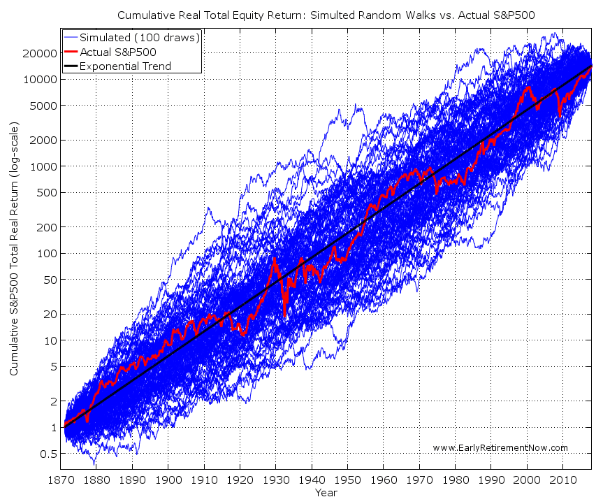
</div>

<div class="navy" align="center">
.font80[**Actual S&P500 and Simulated Random Walk**]
</div>

[A random walk down Wall Street](https://people.duke.edu/~rnau/411rand.htm)


---

## **Efficient Market Hypothesis**

### The Application of the EMH
.font100[
- **Are Reports Published by Investment Advisers Valuable?**

    - No. Information in newspapers and in the published reports of investment advisers is readily available to many market participants and is already reflected in market prices. So acting on this information will not yield abnormally high returns, on average.
    
    - Human investment advisers in San Francisco do not, on average, even outperform an orangutan!
]  
  
---

## **Efficient Market Hypothesis**

### The Application of the EMH - Cont'd
.font100[
- **[Could Someone Be Consistently Successful?](https://catanacapital.com/blog/best-investors-money-managers/)**

    - No. Even if no forecaster can always accurately predict the market, there always will be some who appear to be consistent winners.

    - A scam: mechanically separate a mailing list into two groups and bet on a football game.

]

<div align="center">

</div>

<div class="navy" align="center">
.font80[Warren Buffett]
</div>


---

## **Efficient Market Hypothesis**

### The Application of the EMH - Cont'd
.font100[
- **Should we Be Skeptical of Hot Tips?** 

    - Yes, we should unless you are one of the first to gain the new and unexpected information. If the stock market is efficient, the so-called hot tips should have already been priced so that the expected return of a stock will equal the equilibrium return.

- **Do Stock Prices Always Rise When There Is Good News?** 

    - Not always. When information announced has already been expected by the market, stock prices will remain unchanged. When the announced news is not as good as expected, stock price can also decline.
]    


---

## **Efficient Market Hypothesis**

### Testing the EMH

.font90[

- Information is reflected in prices - not only the type and source of information, but also the quality and speed with which it is reflected in prices. 

- The more information that is incorporated into prices, the more efficient the market becomes.
]

.font100[

**Forms of Market Efficiency**

- Weak Form EMH: Security prices reflect all information found in past prices and volume.

- Semi-strong Form EMH: Security prices reflect all publicly available information.

- Strong Form EMH: Security prices reflect all information, public or private.

]

---

## **Efficient Market Hypothesis**

### Testing the EMH

**Weak Form EMH**

.font100[

- Past data on stock prices are of no use in predicting future stock price changes 

- Technical analysis is of no use 

    - If it were possible to make big money simply by finding "the pattern" in the stock price movements, everyone would do it and the profits would be competed away.

- Should simply use a "buy-and-hold" strategy

]


---

## **Efficient Market Hypothesis**

### Testing the EMH

**Semi-Strong Form of EMH**

.font100[
- Abnormally large profits cannot be consistently earned using public information which includes:

    - Historical price and volume information
    - Published accounting statement
    - Information found in annual reports and public media

- Any price anomalies are quickly found out and the stock market adjusts
]


---

## **Efficient Market Hypothesis**

### Testing the EMH

**Semi-Strong Form of EMH** - Cont'd

.pull-left[
<div align="center">
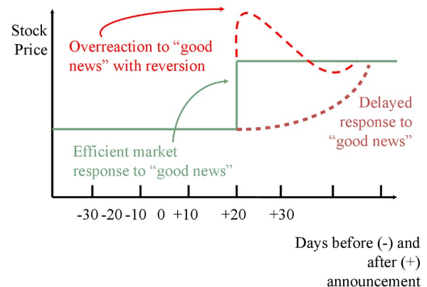
</div>
]


.pull-right[
<div align="center">
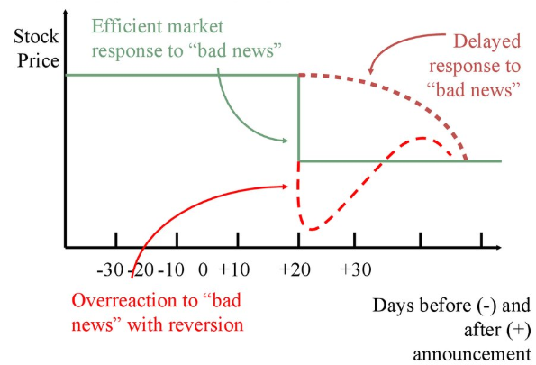
</div>
]


---

## **Efficient Market Hypothesis**

### Testing the EMH

**Strong Form EMH**

.font90[

- There is no information, public or private, that allows investors to consistently earn abnormally high returns

    - Anything pertinent to a stock and known to at least one investor is already incorporated into the security's price.

- Strong form efficiency incorporates weak and semi-strong form efficiency

- There seems to be evidence that the market is not strong form efficient

    - Reason for insider trading laws
    
    - Martha Stewart's Insider Trading Case

]

<div align="center">

</div>

---

## **Efficient Market Hypothesis**

### Testing the EMH

**A Case Study**

- On January 1st 2010, Company A's equilibrium share price is 10$/share and the price in the market is indeed 10$/share

- On March 1st 2010, Company A got a new project that will increase its profit that is expected to raise the company's value by 10%

- This is still a private information and the company only announced it to public on the next day (March 2nd)

- How does the price react according to different forms of EMH?


---

## **Efficient Market Hypothesis**

### What the EMH Does and Does NOT Say

.font100[

- Investors can throw darts to select stocks.

    - This is almost, but not quite, true.
    - An investor must still decide how risky a portfolio he wants based on risk aversion and the level of expected return.


- Prices are random or uncaused.

    - Prices reflect information. 
    
    - The price CHANGE is driven by new information, which by definition arrives randomly. 
    
    - Therefore, financial managers cannot “time” stock and bond sales.

]


---

## **Efficient Market Hypothesis**

### Empirical Evidence

.font100[

- The record on the EMH is extensive, and in large measure it is reassuring to advocates of the efficiency of markets.


- Studies fall into three broad categories:

    - Are changes in stock prices random? Are there profitable “trading rules”?

    - Event studies: does the market quickly and accurately respond to new information?
    
    - The record of professionally managed investment firms.


]


---

## **Efficient Market Hypothesis**

### Empirical Evidence - Cont'd

.font100[

**Are Changes in Stock Prices Random?**

- Can we really tell?
    - Many psychologists and statisticians believe that most people want to see patterns even when faced with pure randomness.

    - People claiming to see patterns in stock price movements are probably seeing optical illusions.
    

- A matter of degree

    - Even if we can spot patterns, we need to have returns that beat our transactions costs.


- Random stock price changes support weak-form efficiency.

]

---

## **Efficient Market Hypothesis**

### Empirical Evidence - Cont'd

.font100[

**Event Studies: How Tests Are Structured**

- Event studies are one type of test of the semi-strong form of market efficiency.

    - This form of the EMH implies that prices should reflect all publicly available information. 

- To test this, event studies examine prices and returns over time—particularly around the arrival of new information.

- Test for evidence of underreaction, overreaction, early reaction, delayed reaction around the event.

]


---

## **Efficient Market Hypothesis**

### Empirical Evidence - Cont'd

.font90[

**Event Study Results**

- Over the years, event study methodology has been applied to a large number of events including:
    - Dividend increases and decreases
    - Earnings announcements
    - Mergers 
    - Capital spending
    - New issues of stock

- The studies generally support the view that the market is semi strong-form efficient.

- In fact, the studies suggest that markets may even have some foresight into the future—in other words, news tends to leak out in advance of public announcements.

]

---

## **Efficient Market Hypothesis**

### Empirical Evidence - Cont'd

.font100[

**Event Studies: Dividend Omissions**

<div align="center">
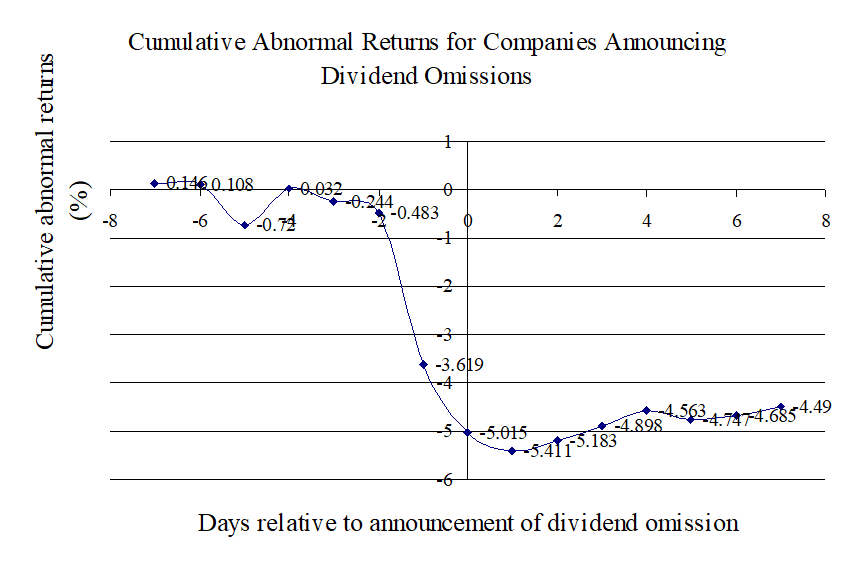
</div>

]

.font80[
Source: Szewczyk, Tsetsekos, and Santout (1997). “Do Dividend Omissions Signal Future Earnings or Past Earnings?”. Journal of Investing.
]


---

## **Efficient Market Hypothesis**

### Empirical Evidence - Cont'd

.font100[

**The Record of Mutual Funds**

- If the market is semi strong-form efficient, then no matter what publicly available information mutual-fund managers rely on to pick stocks, their average returns should be the same as those of the average investor in the market as a whole.

- We can test efficiency by comparing the performance of professionally managed mutual funds with the performance of a market index.

]


---

## **Efficient Market Hypothesis**

### Empirical Evidence - Cont'd

.font100[

**The Record of Mutual Funds**

<div align="center">
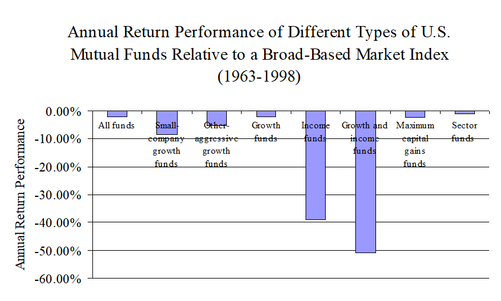
</div>

]

.font80[
Source: Pastor and Stambaugh (2000), “Evaluating and Investing in Equity Mutual Funds,” unpublished paper, Graduate School of Business, University of Chicago.
]

---

## **Efficient Market Hypothesis**

### Empirical Evidence - Cont'd

.font100[

**The Strong Form of the EMH**

- One group of studies of strong-form market efficiency investigates insider trading.

- A number of studies support the view that insider trading is abnormally profitable.

- Thus, strong-form efficiency does not seem to be substantiated by the evidence.


]


---

class: center, middle, inverse

# **Efficient Market Hypothesis Anomalies**

---

## **Efficient Market Hypothesis Anomalies**

.font100[

- Anomalies

    - Calendar Effects
    
    - Small-Firm Effect
    
    - Value Effect
    
    - Momentum Effect
    
    - Mean Reversion
    
    - Stock Market Crash
    
        - In 1987, the NYSE dropped between 20-percent and 25-percent  and the TSE dropped by more than 11-percent on a Monday following a weekend during which little surprising information was released.    
  

]
    
---

## **Efficient Market Hypothesis Anomalies**

.font100[

- Calendar Effects 

    - Stocks returns may be closely tied to the time of year or time of week
    
    - January effect: A seasonal anomaly in financial markets where securities' prices increase in January more than in any other month.
    
    - Weekend effect: A phenomenon in financial markets in which stock returns on Mondays are often significantly lower than those of the immediately preceding Friday.

- Small-Firm Effect 

    - Size of a firm impacts stock returns
    
    - Small firms may offer higher returns than larger firms, even after adjusting for risk

]

    
---

## **Efficient Market Hypothesis Anomalies**

.font90[
  

- Value Effect

    - Uses P/E ratio to value stocks 
    
    - Low P/E stocks may outperform high P/E stocks, even after adjusting for risk
    
- Momentum Effect

    - "winners" are more likely to continue to outperform the "losers"
    
    - Traders can take advantage of these price movements by going long on winners and shorting the losers

- Mean Reversion 

    - Tendency of stocks to exhibit long-term reversals in returns
    
- Other

    - [What's in a name? A lot for stock market, if it’s ‘Oxygen’ in Covid-era!](https://www.thehindubusinessline.com/markets/stock-markets/whats-in-a-name-a-lot-for-stock-market-if-its-oxygen-in-covid-era/article34359283.ece)

    - [Meet Covid Inc., the 40-year-old Tempe company that shares a name with the pandemic](https://www.covid.com/)

]


---


class: center, middle, inverse

# **Behavioral Finance**

---

## **Reading Materials**

.font80[

**Journal Articles**

Daniel Kahneman and Amos Tversky (1979). Prospect Theory: An Analysis of Decision under Risk. Econometrica, 47 (2), 263-292.

Richard H. Thaler and Shlomo Benartzi (2014). Save More Tomorrow™: Using Behavioral Economics to Increase Employee Saving. Journal of Political Economy, 112(S1), S164-S187.

[Nicholas C. Barberis](https://nicholasbarberis.github.io/) (2013). Thirty Years of Prospect Theory in Economics: A Review and Assessment. Journal of Economic Perspectives, 27 (1), 173-196.

**Textbooks**

Robert J. Shiller (2016). Irrational Exuberance: Revised and Expanded, 3 edition. Princeton University Press.

Robert J. Shiller (2019). Narrative Economics : How Stories Go Viral and Drive Major Economic Events. Princeton University Press.

Richard H. Thaler and Cass R. Sunstein (2009). Nudge: Improving Decisions About Health, Wealth, and Happiness. New York : Penguin Books.

B. Douglas Bernheim, Stefano DellaVigna, David Laibson (2018). Handbook of Behavioral Economics - Foundations and Applications 1, 1st edition. North Holland.

B. Douglas Bernheim, Stefano DellaVigna, David Laibson (2019). Handbook of Behavioral Economics - Foundations and Applications 2, 1st edition. North Holland.

]


---

## **What's Going on in Behavioral Finance?**

.font90[
- From the 1950's to the 1990's, finance research was dominated by the rational agent framework (e.g., MPT, EMH)
    

- Starting in the 1990's, a second framework has emerged

    - the behavioral finance framework
    
    - studies the psychological and sociological factors that influence the financial decision making process of individuals, groups, and entities
    

- Behavioral finance argues that some financial phenomena are the result of less than fully rational thinking


- More broadly, it advocates the use of models that are psychologically more realistic


]

---

## **What's Going on in Behavioral Finance?**

- On several dimensions, behavioral finance has been successful

    - explains observed facts in simple, intuitive ways; makes testable predictions
    
    - strong interest among academics, parctioners, and policy makers
    
    - citations, prizes
    

- But it still has some way to go

    - one goal is that all finance researchers are familiar with the core ideas in the field, and apply them as appropriate
    

---

## **Why Behavioral Finance?**

.font100[

- **Assumptions of classical financial models seem unrealistic**
    
    - All investors aim to maximize economic utility
    
    - All investors are rational and risk averse
    
    - Risk/volatility of an asset is known in advance - is constant.
    
    - Asset integration: investors view their investments in a portfolio context.
    
    - All investors have access to the same information at the same time
    
    - All investors have an accurate conception of possible returns.
    
    - All investors are price takers, i.e., their actions don't influence price.
    
 
]


---

## **Why Behavioral Finance?**

.font100[

- **Behavioral Finance offers more realistic assumptions**
    
    - Blends psychology with observations of human behavior.
    
        - Daniel Kahnemam a psychologist won the 2002 Nobel Prize in Economics for his work in behavioral economics.
        
    - Attribute the imperfections in financial markets to a combination of **cognitive biases** such as **overconfidence**, **loss aversion**, **representative bias**, **hyperbolic discounting**, and various other predictable human errors in reasoning and information processing. 

]


---

## **Questions to Test Behavioral Finance**

--

**Question 1**

.font100[

- Suppose you have the chance to play a game that has a 90% chance that you will win. Will you play?

- Suppose you have a game that has a 10% chance that you will lose. Will you play?

]

--

**Question 2**


.font100[

Which option will you choose?

- A sure profit of 5000 euros

- An 80% possibility of gaining 7000 euros, with an 20% chance of receiving nothing (0 euros)

]

---

## **Kahneman Framework of “Two Minds”**

.font100[

- The way people make decisions 

    - an “intuitive” mind: rapid judgments with great ease and with no conscious input

    - a “reflective” mind: slow, analytical and requires conscious effort 

]

<div align="center">
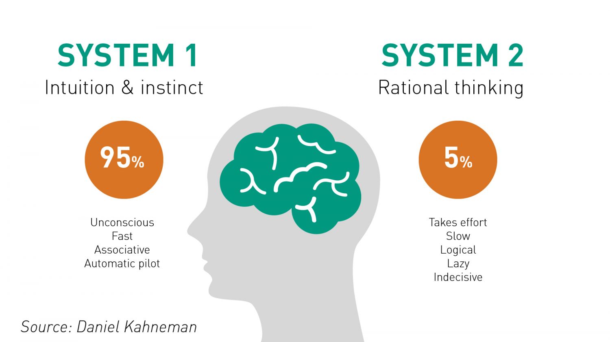
</div>

---

## **Kahneman Framework of “Two Minds”**


.font100[

- One of the insights that earned Kahneman the Nobel Prize is that we humans are sometimes as susceptible to “cognitive illusions” as we are to optical illusions

    - These illusions, also known as biases, result from the use of heuristics, or, more simply, mental shortcuts. 

- Kahneman’s discovery changed psychologists’ understanding of decision making, and, ultimately, economists’, too. 

]


.font100[

- Behavioral economics showed that we are not as logical as we might think, we do care about others, and we are not as disciplined as we would like to be. 

- It is not that people are irrational in the colloquial sense, but that by the nature of how our intuitive mind works we are susceptible to mental shortcuts that lead to erroneous decisions. 
]

.font90[
*“We make intuitive judgments all the time, but it’s very hard for us to tell which ones are right and which ones are wrong”*, says [Nicholas Barberis](https://nicholasbarberis.github.io/).
] 

  
---

## **Cognitive Biases**

.font80[

- Anchoring

    - The use of irrelevant information as a reference for evaluating or estimating some unknown value
    
    - Investors will tend to hang on to losing investment by waiting for the investment to break even at the price at which it was purchased
    

- Regret Avoidance

    - Related to anchoring, regret is the emotion caused by comparing a given outcome or state of events with the state of a foregone choice. 
    
    - *"Don't do this, you will regret it."*
    
- Loss Aversion

    - Related to regret avoidance
    
    - Tendency to strongly prefer avoiding losses to acquiring gains
    

- Endowment Effect 

    - Related to loss aversion, people ascribe more value to things merely because they own them.
    

]

---

## **Cognitive Biases**

.font80[

- Over-extrapolation

    - when forming beliefs about the future, people put too much weight on the recent past
    

- Hyperbolic Discounting

    - People typically intend to forfeit larger rewards in the future for small immediate gains. 
    
    - Would you prefer a dollar today or three dollars tomorrow?
    
    - In the future, we always do right things, e.g., choose between sweets and fruits/vegetables today and a week from now
    

- Illusion of Control

    - The fallacious belief that a person who has experienced success with a random event has a greater probability of further success in additional attemps.
    

- Default Effect

    - The option which the chooser ends up with, when/if he/she does not make an active choice.

]


---

## **Rationality**

**Daniel Kahneman**

- The only test of rationality is not whether a person's beliefs and preferences are reasonable, but whether they are internally consistent.

    - A rational person can believe in ghosts, so long as all his/her other beliefs are consistent.
    
    - A rational person can prefer being hated over being loved, so long as his/her preferences are consistent.
    
- Rationality is logical coherence - reasonable is not.

    - Economists are rational by this definition, but there is overwhelming evidence that humans cannot be rational.
    
    - Economists think what people ought to do. Phychologists watch what people actually do.

---

## **Prospect Theory**

.font90[

- There are **persistent biases** motivated by psychological factors that influence people's choices **under conditions of uncertainty.**

- Prospect theory considers preferences as function of "+**ecision weights**" which do not always match with probabilities

    - Decision weights tend to overweight small probabilities and under-weight moderate and high probabilities

- Investors tend to evaluate prospects or possible outcomes in terms of gains and losses relative to some reference point rather than the final states of wealth.

- Losses loom larger than gains.

- A principle of diminishing sensitivity applies to both sensory dimensions and the evaluation of changes of wealth. 

    - e.g., the perceived gain between 900 and 1000 is much smaller than the gain between 100 and 200
]


---

## **Classical versus Behavioral**


.font100[

.pull-left[

.content-box-purple[**Classical Finance**]

**Rationality** 

People in standard finance are rational. They are not confused by frames, they are not affected by cognitive errors, they do not know the pain of regret, and they have no lapses of sef-control ([Meir Statman](https://www.scu.edu/business/finance/faculty/statman/)). 
]


.pull-right[

.content-box-purple[**Behavioral Finance**]

**Irrationality**

People in behavioral finance may not always be rational, but they are always normal. Normal people are always confused by frames, affected by cognitive errors and know the pain of regret, and the difficulty of self control.

]

]

---

## **Classical versus Behavioral**

.font100[

.pull-left[

.content-box-purple[**Classical Finance**]

**Risk Aversion** 

- investors consider the expected value of the outcome relative to the variability. 
]


.pull-right[

.content-box-purple[**Behavioral Finance**]


**Loss Aversion** 

- described by Prospect Theory (Kahneman and Tversky, 1979) 

- the pain of a loss is greater than the joy of a gain, so investors choose the safe alternative unless the risks outcome has a very high expected return.
]

]


---

## **Classical versus Behavioral**

.font100[

.pull-left[

.content-box-purple[**Classical Finance**]

**No Reference Dependence**

- investors will consider the terminal wealth value. 
]


.pull-right[

.content-box-purple[**Behavioral Finance**]

**Reference Dependence** 

- an investor’s decision will depend on where they are now, their reference point.
]

]


---

## **Classical versus Behavioral**

.font100[

.pull-left[

.content-box-purple[**Classical Finance**]

**Asset Integration** 

- assets are viewed in a portfolio context. 
]


.pull-right[

.content-box-purple[**Behavioral Finance**] 

**Asset Segregation** 

- assets are viewed individually. This may lead investors to choose an incorrect combination.
]

]


---

## **Classical versus Behavioral**

.font100[

.pull-left[

.content-box-purple[**Classical Finance**]

**Frame Independence** 

- preferences do not depend on how the question is framed. 
]


.pull-right[

.content-box-purple[**Behavioral Finance**]

**Mental Accounting**

- investors may have separate "mental accounts" in which they place their funds. This may lead to different preferences depending on how the question is “framed."
]

]


---

## **Classical versus Behavioral**

.font100[

.pull-left[

.content-box-purple[**Classical Finance**]

**Rational Expectations** 

- investors are unbiased, rational decision makers. 
]


.pull-right[

.content-box-purple[**Behavioral Finance**]

**Biased Expectations**

- people tend to be **overconfident** about their ability to predict unknown, future events.
]

]


---

## **Classical versus Behavioral**

.font100[

.pull-left[

.content-box-purple[**Classical Finance**]

**Rational Expectations** 

- investors understand random chance and do not draw conclusions based on small samples.
]


.pull-right[

.content-box-purple[**Behavioral Finance**]

**Representativeness**

- investors tend to **draw strong conclusions from small samples**.

- investors tend to overestimate the effects of random chance.
]

]


---

## **Classical versus Behavioral**

.font100[

.pull-left[

.content-box-purple[**Classical Finance**]

**Rational Expectations** 

- investors do not **ignore relevant information**.
]


.pull-right[

.content-box-purple[**Behavioral Finance**]

**Belief Perseverance**

- investors tend to ignore information that conflicts with their existing beliefs. 

- investors may react to “irrelevant information” and hence may trade on “noise” rather than information.

]

]


---

## **Nudge Theory**


.font100[

Nudge means using choice architecture (positive reinforcement and indirect suggestions) to push people to choose desired result.

- **Can application of psychological principles improve people’s financial decisions?**
    
- Thaler and Bernatzi (2004) find that people fail to save enough for their retirement due to 

    - the loss-aversion bias (i.e., decrease in take-home money),
    - procrastination (i.e., people tend to procrastinate when it comes to unpleasant tasks) and
    - hyperbolic discounting (an apple today will be preferred to two apples tomorrow).

]

---

## **Nudge Theory**

.font100[

**The SMarT Plan**

“Save More Tomorrow”, a pension program created by Thaler and Benartzi, is the classic financial nudge.
]

.font90[
- Because of hyperbolic discounting, people will find it more attractive to save later than now. Therefore, employees are approached, as early as possible before the program actually starts.

- The increase in pension contributions of the person joining the SMarT plan, will happen when they get their next pay-raise to avoid feelings of loss.

- The default option is that the SMarT person’s contribution will gradually increase in percentage points with each pay raise, until it reaches a pre-set maximum. 

- People can opt-out at any time. 


]

---

## **Nudge Theory**

.font100[

**The SMarT Plan**: Experiment with 286 employees:

]

.font80[

- 79 made own saving plans

- 45 joined a one-off saving plan

- 162 joined the SMarT plan

<div class="navy" align="center">
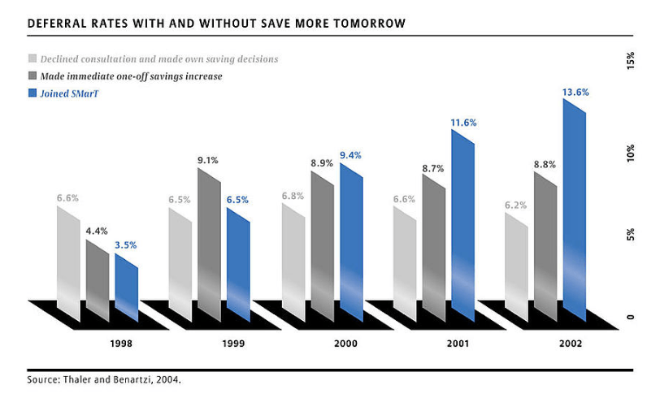
</div>

]

---

## **Nudge Theory**


.font100[

**What Do We Learn From The SMarT Plan?**

- The strategic application of a few key psychological principles can dramatically improve people’s financial decisions.

    - The program is now offered by more than half of the large employers in the United States, and a variant of the program was incorporated in the Pension Protection Act of 2006 (Hewitt, 2010).
    
- Financial advisors can take advantage of such insights in their own practices to help their clients make better decisions which, ultimately, should lead to better financial outcomes.

]


---

## **Behavioral Finance Evidence**


.font100[

**Over-extrapolation of returns**

]

.font90[

- recent returns on an asset have been good/poor, people think future returns will be good/poor

- return extrapolation can be found in qualitative accounts going back decades with the first wave of academic research started in the 1990's (Cutler et al., 1990; De Long et al., 1990; Hong and Stein, 1999)

- recently, there has been a second wave of research, spurred by survey data, which provides evidence of extrapolation (e.g., [Greenwood and Shleifer](https://www.nber.org/reporter/2019number1/return-survey-expectations), 2014)

    - ask investors, individual and institutional, for their forecasts of future stock market returns
        

]


---

## **Behavioral Finance Evidence**

.font100[

**Over-extrapolation of returns**

]

.font90[
        
- models in which investors extrapolate past returns can explain several of the most important facts about asset prices

    - momentum and long-term reversals
    
    - time-series predictability: in aggregate asset classes, ratios of price to fundamentals predict subsequent returns with a negative sign (cambell and schiller, 2001)
    
    - bubbles

]

---

## **Behavioral Finance Evidence**

.font100[

**Over-extrapolation of returns**

]

.font90[

- Time-Series Predictability

]

<div align="center">
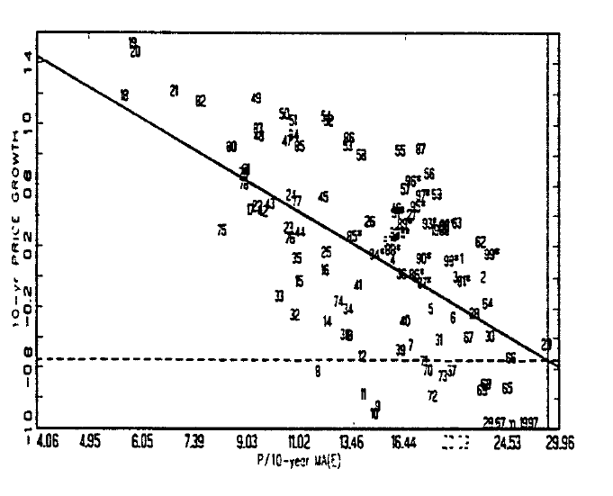
</div>


<div align="center">
Source: Cambell and Schiller (2001)
</div>


---

## **Behavioral Finance Evidence**

.font100[

**Over-extrapolation of returns**

]

.font90[

- Bubbles

    - episodes where the price of an asset rise dramatically and then collapses

    - during the price rise, there is much talk of possible overvaluation as well as high volumn

- Speculative economic bubbles are an obvious anomaly, in that the market often appears to be driven by buyers operating on **irrational exuberance**, who take little notice of underlying value

    - Large gaps between actual asset price and fundamental value
    
    - Internet stock bubble of late 1990s
    
    - US Housing bubble


]


---

## **Behavioral Finance Evidence**

.font100[

**Over-extrapolation of returns**

]

.font90[

- A framework where some investors extrapolate past returns can explain these facts

- Barberis, Greenwood, Jin, Shleifer (2015, 2018)

- Price path in the presence of extrapolators

]    
  
<div align="center">
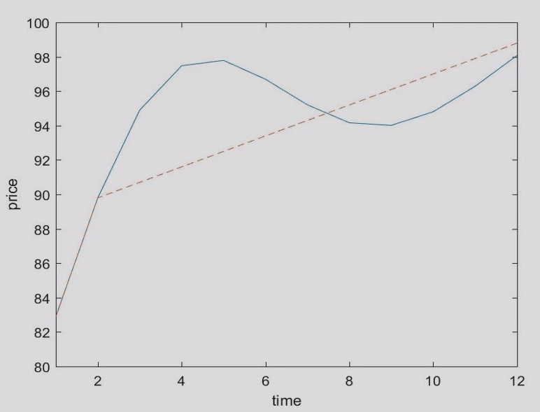
</div>


.font90[

- Why do people extrapolate past returns?

    - Kahneman and Tversky, 1971): "Law of small numbers"

]  


---

## **Behavioral Finance Evidence**

.font100[

**Overconfidence**

]

.font90[

- Type 1: "Overplacement": 

    - People have overly rosy views of their abilities relative to other people

- Type 2: "Overprecision": 

    - People are too confident in the accuracy of their beliefs
    
]    
---

## **Behavioral Finance Evidence**


.font100[
    
**Overconfidence**

]

.font80[

- The **large trading volume in financial market**, which are unlikely to be explained by non-speculative motives. Most trading is likely speculative. Investors trade on their beliefs rather than on pure facts.
    
    - key point: it is hard to generate a large amount of speculative trading in an economy with rational investors (each investor infers others' information from prices or from their willingness to trade)
    
    - with overconfidence, each investor overestimates the precision of her analysis, and underestimates the precision of others' analyses
    
    - several papers provide direct evidence linking overconfidence to trading volume. Grinblatt and Keloharju (2009) use military records to estimate overconfidence (self-reported) for a large sample of individuals in Finland. They find a significant link between overconfidence and trading in subsequent years.
    
- Why there are so many **acquisitions**, when there is little evidence that they create value for the acquirer? -> CEO overconfidence (Malmendier and Tate, 2008)
    
- Stock market **bubbles** may also be explained by overconfidence and social contagion (fads).
    

]


---

## **Behavioral Finance Evidence**

.font100[
    
**Gain-loss utility with prospect theory**

]

.font80[

- Given people's beliefs about the potential outcomes of an investment decisions, how do they evaluate these outcomes?

- Kahneman and Tversky (1979): probability weighting

- examples of probability weighting: lottery, insurance

- **probability weighting** predicts that the skewness of an asset's return will be priced, even idiosyncratic skewness (Barberis and Huang, 2008; Barberis et al., 2019)

    - positively-skewed assets will be overpriced and will earn low average returns and vice versa

]

.pull-left[


<div align="center">

</div>
]

.pull-right[


<div align="center">
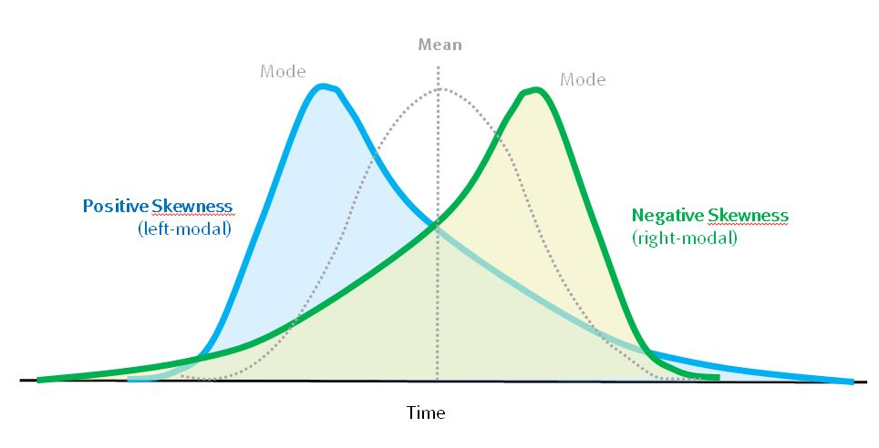
</div>
]


---

## **Behavioral Finance Evidence**


.font100[
    
**Gain-loss utility with prospect theory**

]

.font80[

- Application

    - some average returns are puzzlingly high, e.g., the equity premium on the aggregate stock market 
    - **the aggregate market has negatively-skewed returns**
    
    - other average returns are puzzlingly low, e.g., the average return on IPO stocks in the 5 years after issue (Loughran and Ritter, 1995) 
    - **IPO stocks have positively-skewed returns**

]


---

## **Behavioral Finance Evidence**


.font100[
    
**Gain-loss utility with prospect theory**

]

.font80[

- Application

    - some average returns are puzzlingly high, e.g., the equity premium on the aggregate stock market 
    
    - other average returns are puzzlingly low, e.g., the average return on IPO stocks in the 5 years after issue (Loughran and Ritter, 1995)

]

<div align="center">
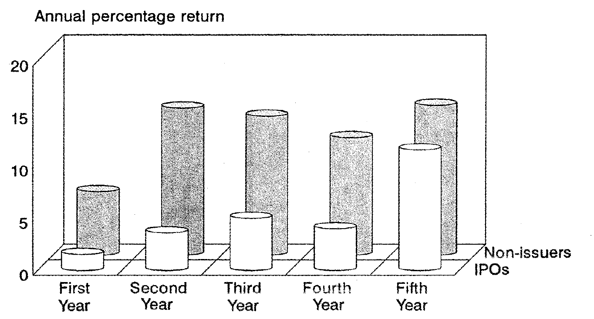
</div>


---

## **Behavioral Finance Evidence**

.font80[

- Loss Aversion 

    - The lack of short selling (causing over-priced stocks) may be explained by loss aversion and also explain why stock prices are sometimes overvalued.
    - People often sell winning stocks too soon because the act of selling a winning stock realizes a gain, and that gives us pleasure. 


- Herding 

    - Professional Money Managers may select stocks that other managers select to avoid “falling behind” and “looking bad”. 


- Window-dressing/Over-Extrapolation

    - Professional Money Managers add to the portfolio stocks that have done well in the recent past and sell stocks that have recently done poorly.   
    
- Inertia/Hyperbolic Discounting 
    - Inertia is at play when people know they should be doing certain things that are in their best interests (saving for retirement, dieting to lose weight, or exercising), but find it hard to do today. 

]


  
  